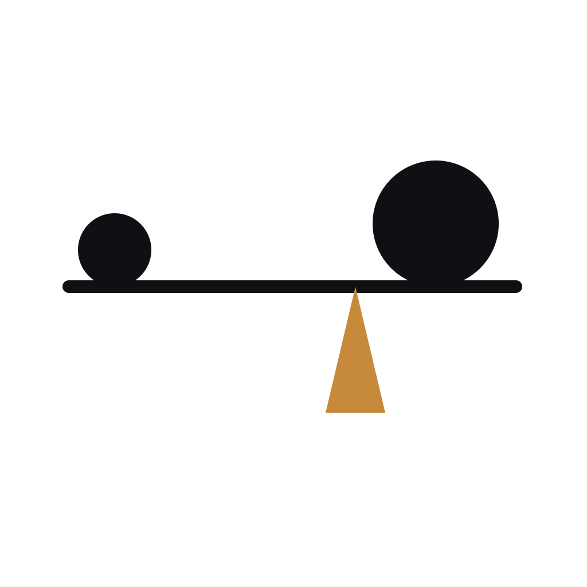

<p align="center">
  
</p>

# Maestria

**Maestria** is a local **AI-model browser & manager**. It scans a folder of
model files (GGUF / safetensors), parses their headers, enriches and tags them,
and lets you launch them as local inference servers — all offline, no cloud, no
account, no telemetry. Available for **Windows**, **Linux**, and **macOS**.

> **Maestria is an independent fork of [TagSpaces](https://github.com/tagspaces/tagspaces)**
> (© TagSpaces GmbH), re-purposed from a general file organizer into a
> specialized AI-model hub. It is **not affiliated with, nor endorsed by,
> TagSpaces GmbH**. Distributed under **AGPL-3.0**; original TagSpaces
> copyright and license notices are preserved.

---

## ✨ What it does

- **Model library browser** — treat a directory of local models as a tagged,
  searchable library (grid / list / treemap / calendar / graph perspectives).
- **Header parsing** — reads GGUF / safetensors metadata (architecture, params,
  quantization, context length, license, …) without loading the whole file.
  Sharded models are handled as one logical entity.
- **Auto-tagging & sidecars** — derives system tags (`arch:`, `quant:`,
  `ctx:`, `lic:`, `dir:`, …) and stores them in per-file `.ts/` sidecars; your
  manual tags, notes and run presets are kept.
- **Run via llama.cpp** — `llama-server` is the only supported runner.
  Hardware-aware autotune picks `ngl`, `ctx`, `threads`, `batch`, `flashAttn`,
  `mlock`, `port`; the model's native llama-server UI opens in your browser.
- **MCP server** — exposes the library to external clients (Claude Code,
  Cursor, scripts) over a local HTTP+SSE transport with bearer-token auth:
  namespaced `models.*`, `tags.*`, `description.*`, `hardware.*` tools.
- **Offline & private** — 100% local, serverless, no vendor lock-in.

---

## 👩‍💻 Developer guide

### Stack

- **UI:** [React](https://react.dev/) + [MUI](https://mui.com/)
- **Desktop:** [Electron](https://www.electronjs.org/)
- **Engine:** [llama.cpp](https://github.com/ggml-org/llama.cpp) (`llama-server`)

### Build & run from source

```bash
git clone https://github.com/Syphys/maestria.git
cd maestria
git checkout develop
npm install

# A local web service handles indexing + thumbnails. Create release/app/.env
# with a custom key so instances don't collide on the shared port:
echo "KEY=a_custom_key" > release/app/.env

npm run dev          # development (hot reload)
# or
npm run build && npm run start
```

### Testing

```bash
npm run test-unit
npm run test-playwright
```

### Packaging

```bash
npm run package-win      # Windows
npm run package-linux    # Linux
npm run package-mac      # macOS (Intel)
npm run package-mac-arm64
```

> Run `npm run build` before packaging. Use the **non-`-pro`** package scripts
> only — the proprietary `@tagspacespro` code must not be bundled in this
> AGPL fork.

---

## 📄 License

Maestria is licensed under the **[GNU AGPL-3.0](LICENSE.txt)**.

It is a modified fork of TagSpaces (© TagSpaces GmbH, also AGPL-3.0). The
original copyright, license, and author notices are retained as required by
the AGPL. The TagSpaces name and logo are trademarks of TagSpaces GmbH and are
**not** used by this fork; "Maestria" and its assets are distinct. There is no
commercial/dual license for Maestria — AGPL-3.0 only.
