# Maestria — architecture diagrams (PlantUML)

🌐 **Language** : 🇬🇧 english · [🇫🇷 français](../fr/README.md)

Full UML conceptual space of Maestria's AI / routing / sandbox / MCP /
embedder / characterization stack. PlantUML source kept in git so it
diffs like code. Strictly DRY: every class / actor / component is
**defined once** in a partial under `_includes/`, and referenced from
every composer that needs it via `!include`.

Diagrams are embedded inline below. Sources live next to them in
`_includes/` + the per-type folders (`components/`, `sequences/`, …);
the rendered SVGs land in [`svg/`](svg/) — see [Rendering](#rendering)
to regenerate after editing.

## Architectural walkthrough

The diagrams below are ordered the way you would explain Maestria to a
new contributor — outside-in, then peeling one layer at a time. Read
top-down on a first pass; jump straight to a section when chasing one
concern.

### 1. Bird's-eye view — what Maestria is

Maestria starts as a TagSpaces fork specialised for browsing,
characterising and launching local `.gguf` models from a
user-configured folder (e.g. `~/Models` on Linux/macOS,
`D:\models` on Windows).
Three diagrams answer "what is it" at three altitudes.

**C4 context** — Maestria as a black box surrounded by the *real*
external systems: the user, the local filesystem, llama.cpp
(`llama-server` and `llama-embedding`), and the MCP clients
(Claude Desktop, deer-flow, scripts). Best first read.

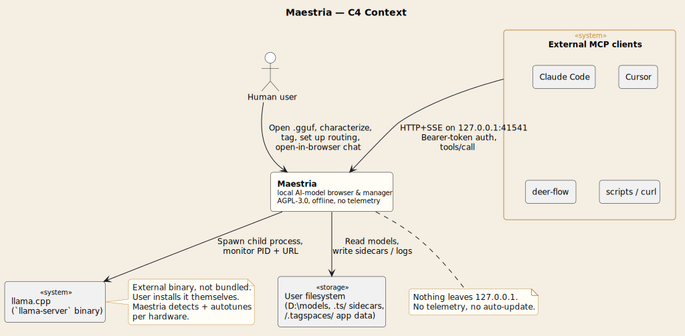

**System overview** — bird's-eye composite that opens the box: every
internal component rendered at the same level using the shared
`_includes/components/*` partials. Useful for showing "where does X
live" without leaving one page.

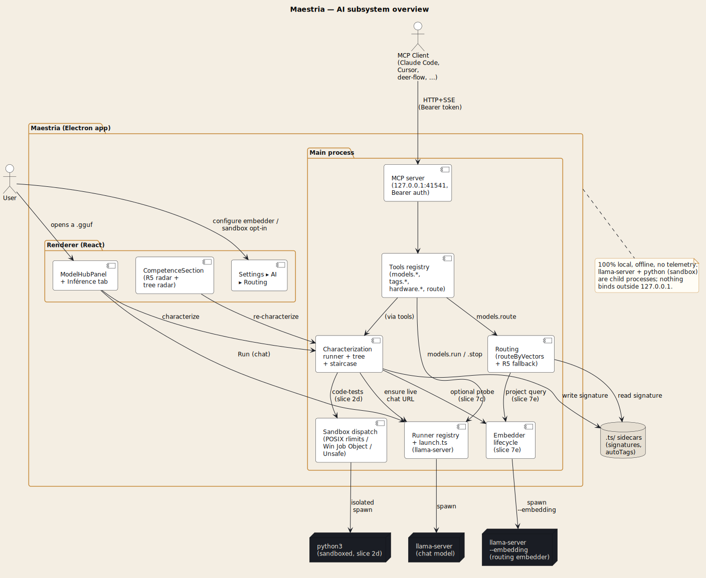

**Deployment** — runtime topology: the Electron processes (renderer +
main), the spawned `llama-server` instances on
`127.0.0.1:8080/8081/8082`, the MCP HTTP+SSE listener on
`127.0.0.1:41541`, and the on-disk layout (the user-chosen models
folder, sidecars under `.ts/`). The renderer is **optional in headless mode**
(`--headless` / `MAESTRIA_HEADLESS=1`): the tray icon stays as the only
UI surface and lazily spawns a window on demand — see section 8.

Per-location options the fork unlocks vs upstream: the
`fullTextIndex` toggle in the location editor is no longer gated
behind a Pro paywall — the underlying pipeline
(`@tagspaces/tagspaces-search` for querying and the indexer's
`extractTextContent` mode for the on-disk `tsft.jsonl`) is entirely
open-source. The `BetaLabel` stays as a heads-up that the
PDF/Office extractors are still being polished. For a pure
`.gguf`/`.safetensors` model folder the fulltext payload is empty
(binary files yield no extractable text); useful when README /
model-card / notes files coexist alongside the model binaries.

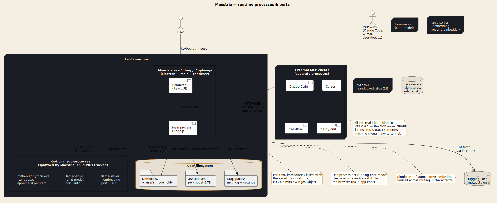

### 2. Who triggers what — actors and use cases

The User (Maestria UI) plus the *MCP-client* actor (Claude Desktop /
deer-flow / aider). Both can list / search / launch / stop models;
only the User triggers characterisation and configures sandbox opt-in.

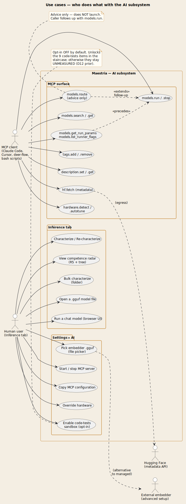

### 3. The model library — TS package graph

The `src/main/modelhub/**` and `src/renderer/modelhub/**` TypeScript
packages with their dependency edges. Shows how `routing/`,
`runners/`, `mcp/`, `embedder/`, sidecar I/O and the renderer UI all
hang off the same `modelhub` root. Annotated with the 2026-05-24 wave
(per-session log archives, `--timeout 86400`, 3-tier non-chat-model
filter).

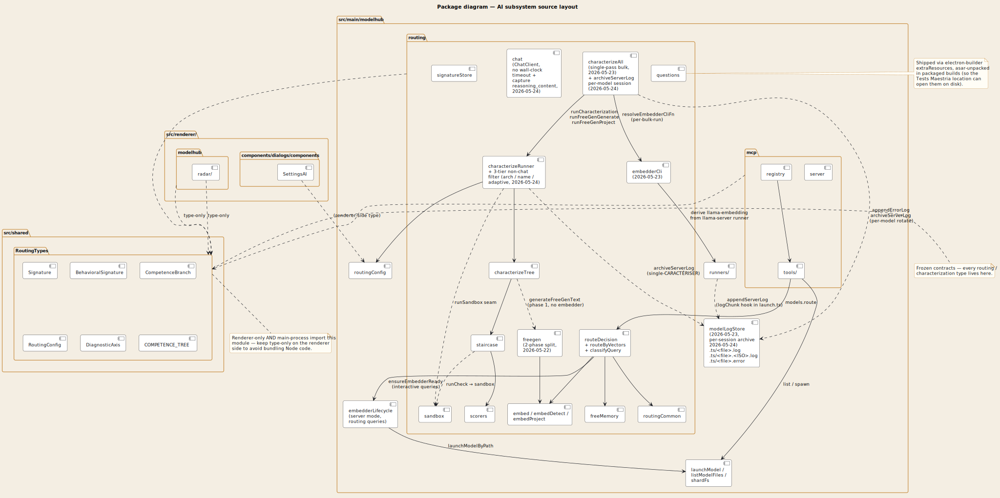

### 4. Launching and supervising a model

A "model" in Maestria is a long-lived `llama-server` (or
`llama-embedding`) process. The lifecycle is the same shape whether
the caller is the UI, the embedder bootstrap, or an MCP client.

**Runner state machine** — Requested → Validating → Spawning → Booting
→ Live → Stopping → Exited, plus the early rejection branches.
Includes the `--timeout 86400` invariant added on 2026-05-24 so PR
#22907's wall-clock timeout never cancels a long chat. `launchedBy`
(`null` / `"via MCP — …"` / `"embedder"`) is the single field that
distinguishes the three caller paths.

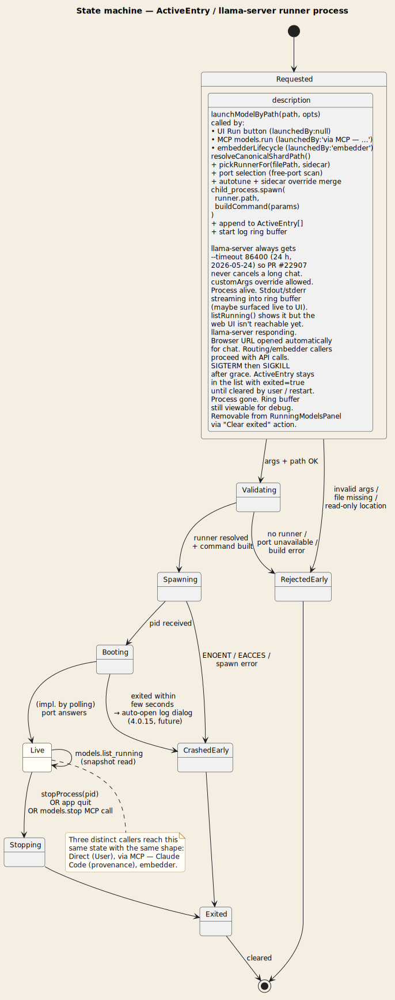

**Superviseur snapshot** — a frozen view of `listRunning()` exactly as
the renderer paints it in `RunningModelsPanel`: three `ActiveEntry`
instances grouped by `launchedBy` ("Direct", "embedder", "via MCP —
Claude Code"). Since 2026-05-24 the panel is non-collapsible with
bounded scroll.

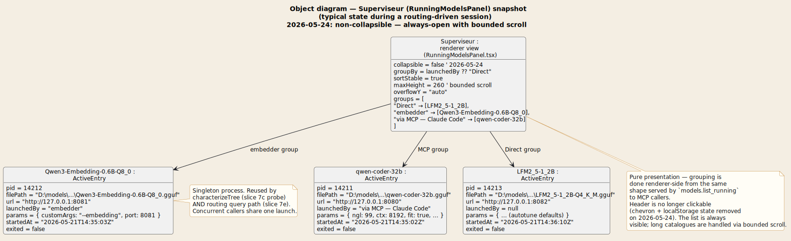

**Embedder startup** — singleton lifecycle of the `llama-embedding`
(or persistent `llama-server` in embedding mode): who triggers the
boot, port selection, readiness probe, reuse by concurrent callers
(characterizeTree slice 7c probe + routing slice 7e share one launch).

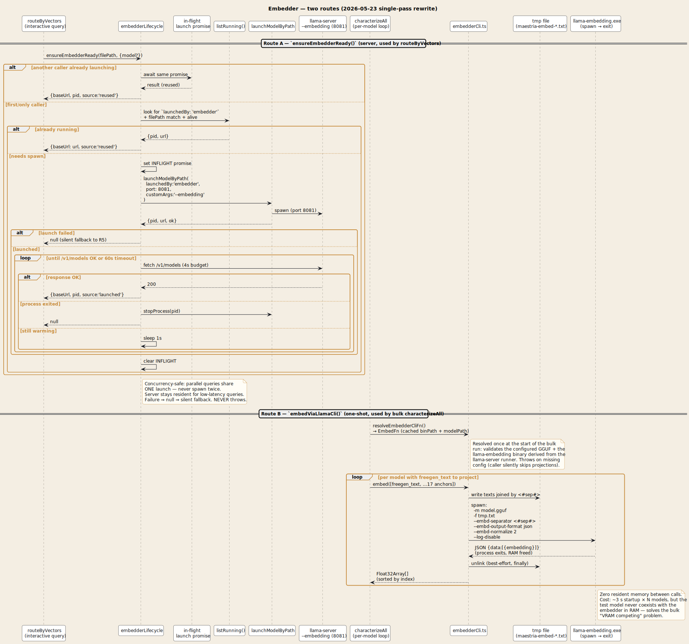

**Embedder component** — internal stack: lifecycle manager, embedding
HTTP client, anchor cache, one-shot CLI wrapper. The one-shot
`llama-embedding.exe --embd-output-format json` path is now the
default for free-gen projection (no resident process during
characterization).

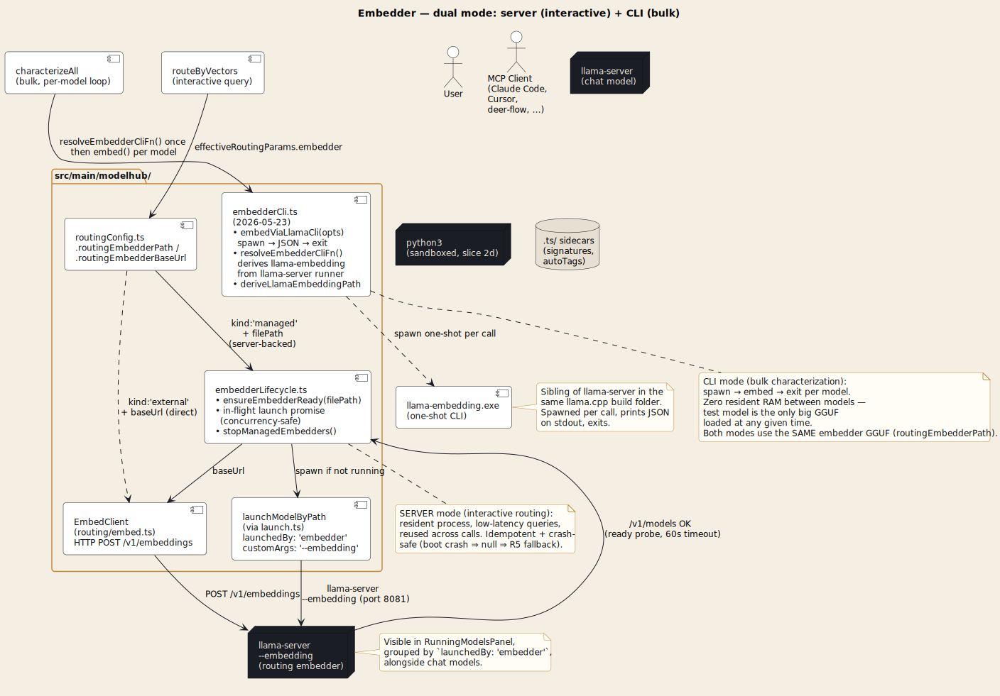

**Runner setup dialog** (`RunnerSetupDialog`) — manages the
`llama-server` binaries Maestria can spawn. Auto-detects entries on
PATH and in the usual build dirs (`~/llama.cpp/build/bin`,
`~/ik_llama.cpp/build/bin`, …); manual add via a native file picker
(folder icon in the binary-path field → `selectLlamaServerBinaryDialog`
IPC → Electron `dialog.showOpenDialog` filtered for `.exe` on Windows,
all files on POSIX). The "llama.cpp releases" button routes through
the `openUrl` IPC → `shell.openExternal` so the link opens in the OS
default browser (a plain `window.open` pops a blank Electron child
window in packaged builds).

### 5. Characterising a model — the heart of Maestria

Characterisation produces a `Signature` (R5 behavioural vector + tree
of competence scores + optional free-gen projection) and stores it
next to the model sidecar. The flow is intentionally adaptive: cheap
checks first, expensive checks only on models that look like they will
benefit.

**Escalation policy** — pre-launch non-chat filter (arch + name +
pooling), then R5 pass with Tier 3 adaptive quarantine, then
per-branch staircase (slice 4c), then optional free-gen + projection
(deferred to phase 2 per `characterizeAll`). Read this first to
understand *why* a given model is or isn't escalated.

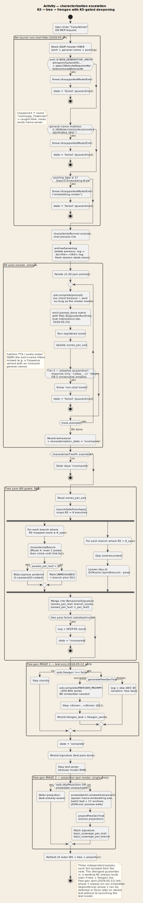

**Full single-model runtime** — UI → `characterizeRunner` → header
read → launch → R5 → tree → free-gen text → chat-server stop →
embedder one-shot → projection patch → status:'done'. The
`prompt_done` event now carries the full `DiagnosticRunEntry` so the
« Interactions » tab updates live.

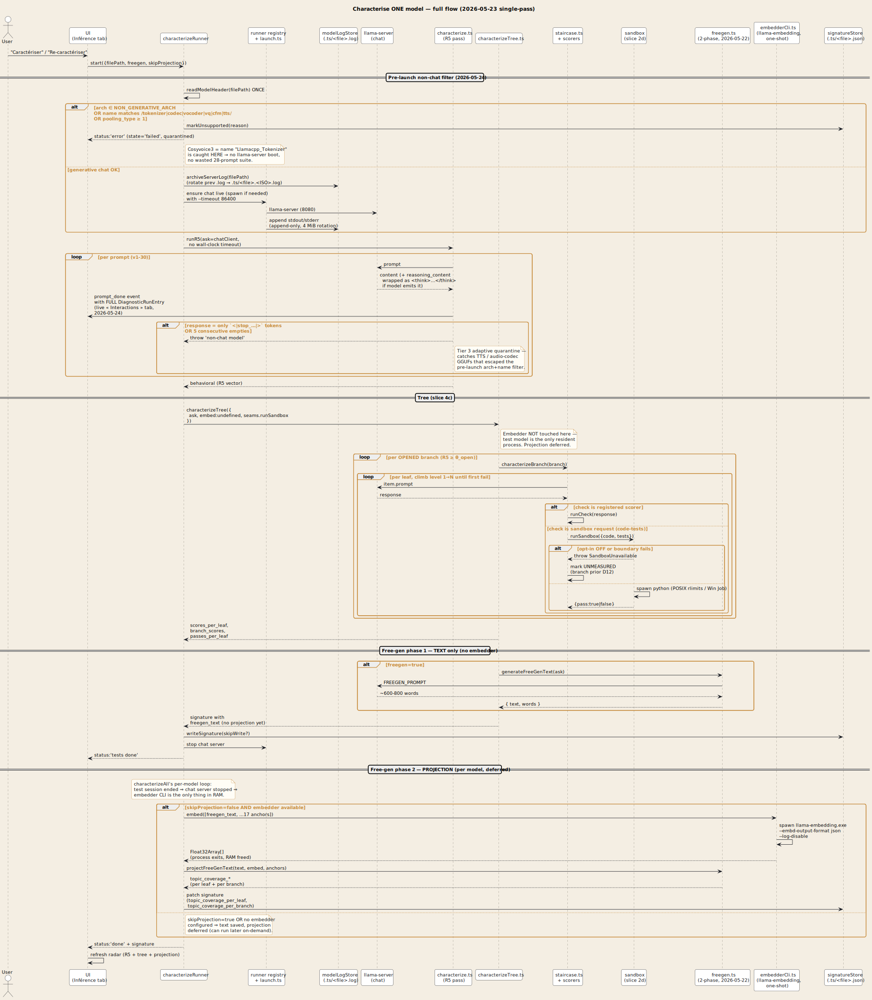

**Signature shape** — `Signature`, `BehavioralSignature`,
`TreeBranchScore`, `freegen_text`, `topic_coverage_per_leaf/per_branch`,
the `characterization_state` enum, unsupported-reason field.

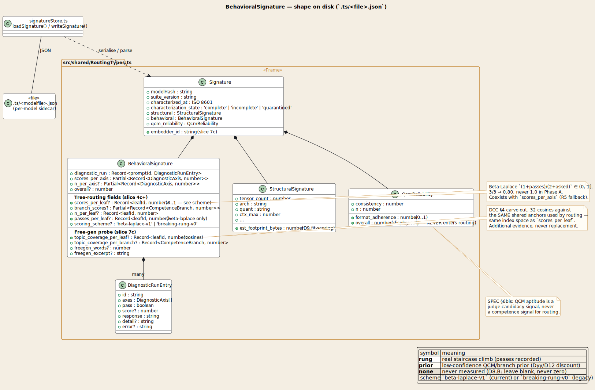

**Concrete sample** — a populated signature (qwen-coder-32b after a
successful Caractériser), values across every field — easier than the
class diagram for orienting yourself the first time.

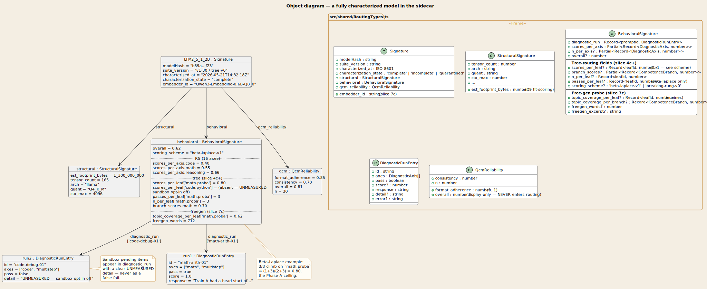

**Signature lifecycle** — the sidecar's `characterization_state`
machine: `none` → `running` → `done` / `failed` (with quarantined
unsupported subtype for the non-chat case), `done` → re-`running` on
Re-caractériser, archive of the previous `.log` file on every relaunch.

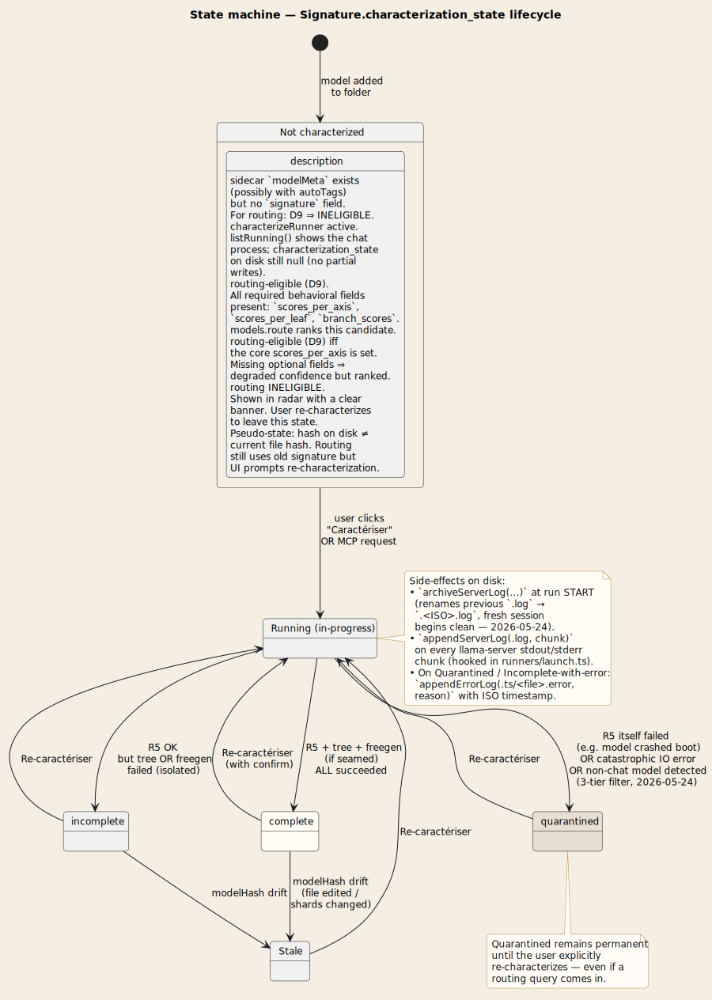

**COMPETENCE_TREE** — the canonical tree the staircase walks: branches
(`reasoning`, `code`, `math`, `factual`, …), leaves with item prompts
+ scorers + optional sandbox checks. Defined once in
`_includes/classes/competence-tree.iuml`.

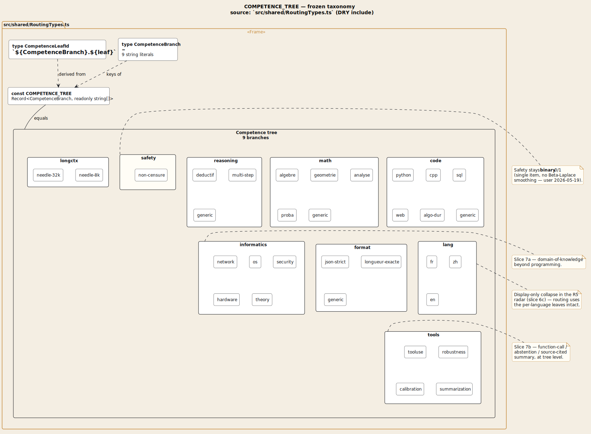

**Free-gen module** — 2-phase (since 2026-05-22): phase 1 generates
the ~600-800 word text against the chat server, phase 2 (deferred per
model in `characterizeAll`) projects it via the embedder against the
17 anchor texts to derive `topic_coverage_*`.

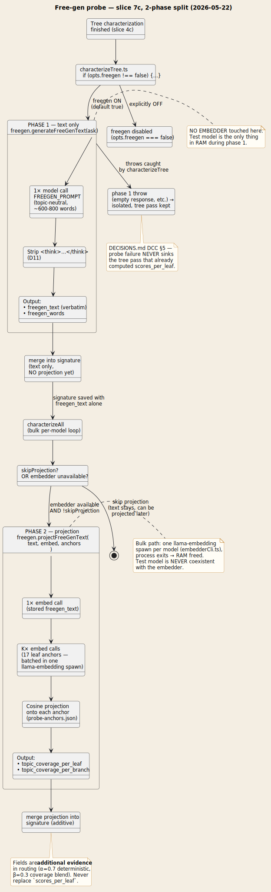

**Characterisation stack** — runner, R5 + tree modules, scorers,
sandbox seam, free-gen, signature store.

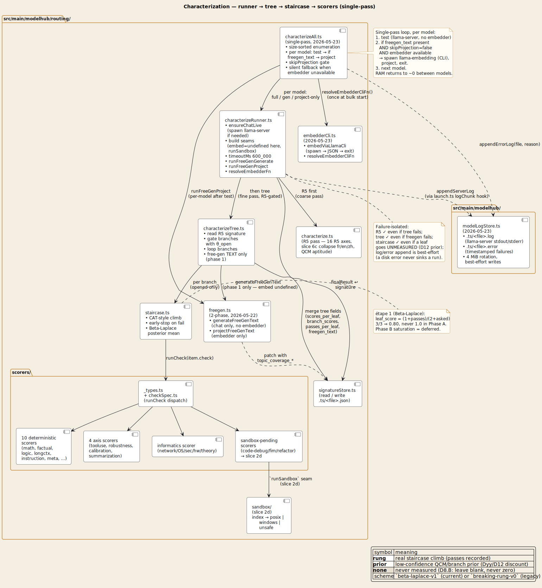

### 6. The sandbox — code-execution checks

Some competence leaves run *code* (Python test cases). Maestria
delegates to a sandbox provider chosen per platform, with an opt-in
gate (Settings ▸ AI ▸ Routing) — if opt-in is off or the boundary
test fails, leaves that need code are marked **UNMEASURED** and the
branch prior (D12) is used instead.

**Sandbox stack** — provider factory, POSIX implementation
(rlimits-based), Windows implementation (Job Object via PowerShell),
UnsafeSandbox (development-only fallback).

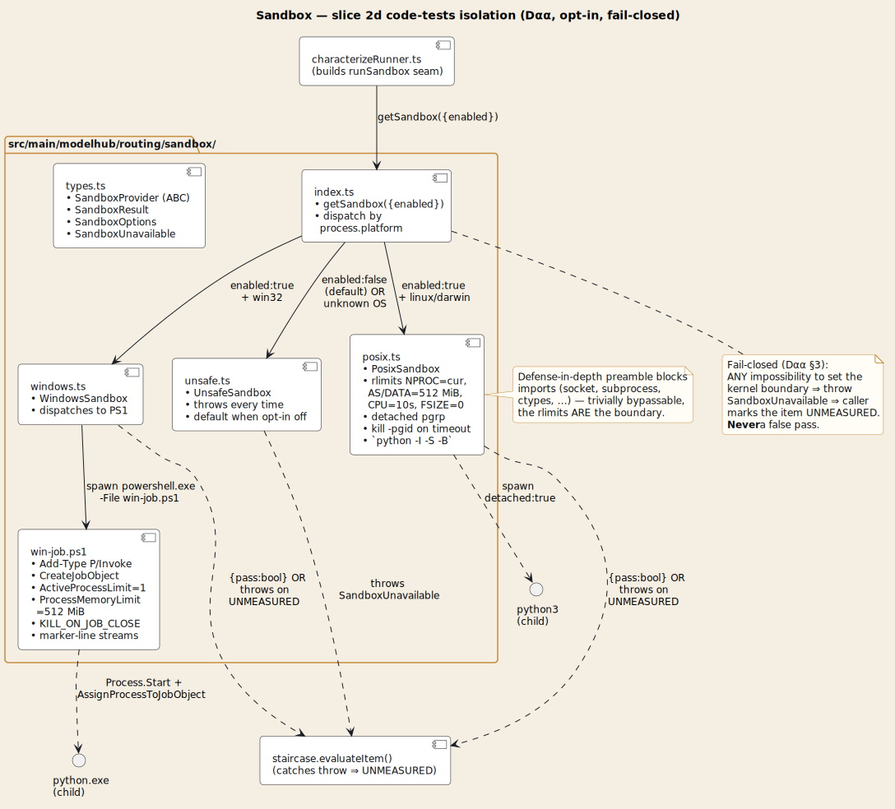

**Provider class hierarchy** — `SandboxProvider` ABC, `Result` /
`Options` / `Unavailable`, concrete Posix / Windows / Unsafe
subclasses.

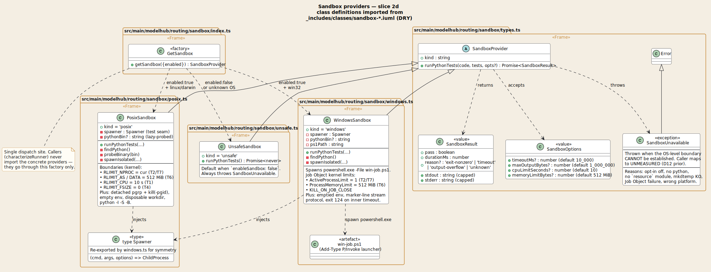

**Dispatch state** — how the provider for the current run is resolved
(platform, opt-in, boundary probe), what the fallbacks are, and which
state surfaces `SandboxUnavailable`.

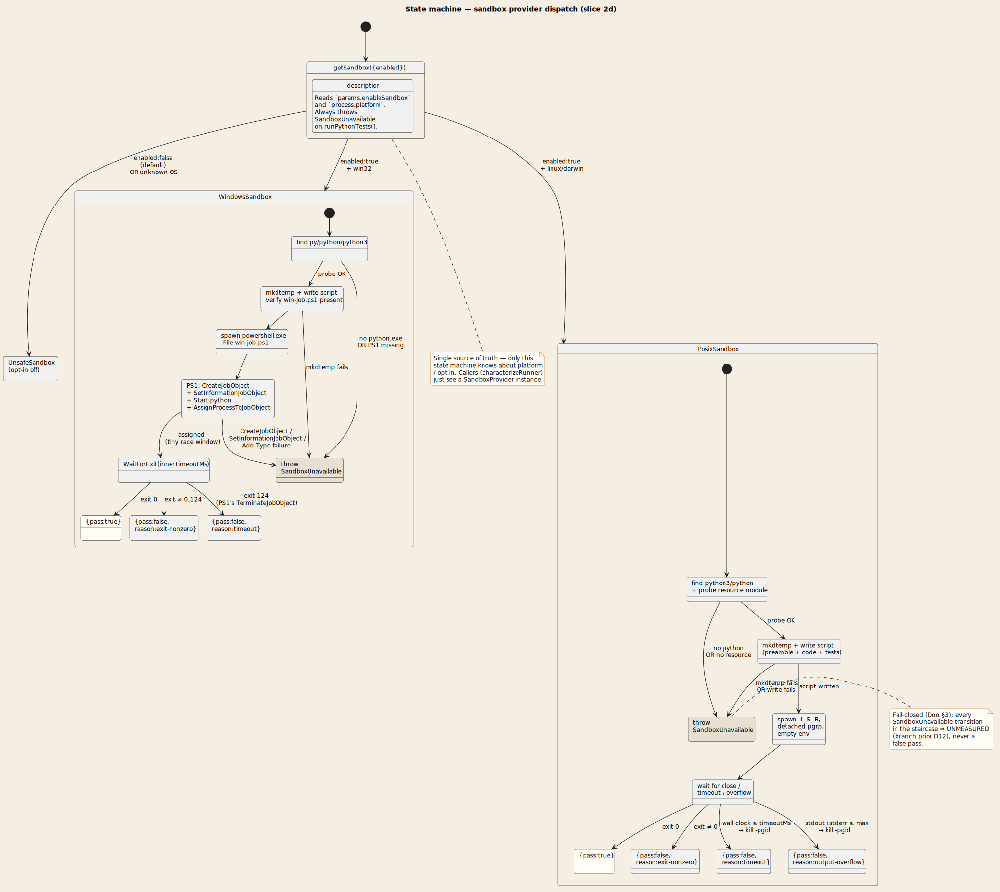

**One `runSandbox({code, tests})` call end-to-end** — temp dir, spawn
under rlimits/Job, capture, judge, cleanup.

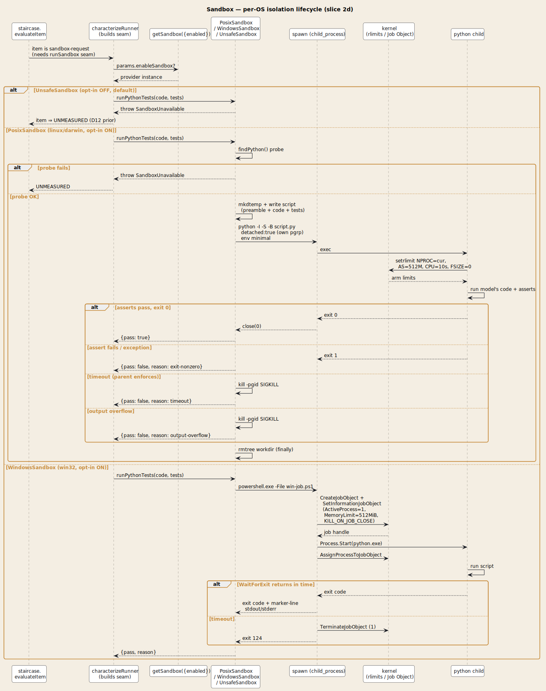

**Kill paths** — every way a sandboxed process can die (CPU limit, RSS
limit, wall clock, parent exit, user-triggered stop, watchdog), and
what each surfaces back to the caller.

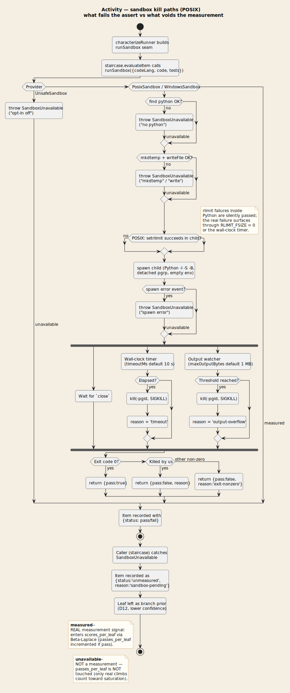

### 7. Routing — using the characterised library

Once models carry signatures, the routing layer can pick the best fit
for an incoming chat request — scored against the user's prompt with
contributions from R5, competence priors, free-gen topic coverage and
the hardware-aware autotune.

**Routing stack** — chat client wrapper (`chat.ts`, no wall-clock
timeout since 2026-05-24), characteriser-driven scorers, competence
routing (slice 9), free-gen projection lookup, autotune bridge.

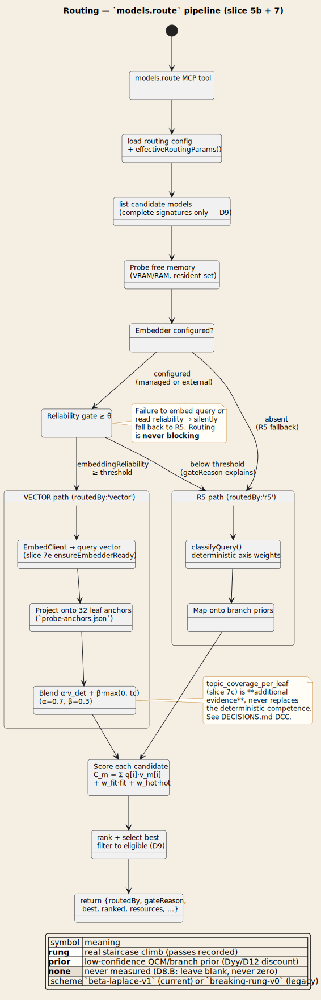

**Decision policy** — candidate set, score composition (R5 + tree +
topic coverage), tie-breakers, the user's manual pin, fallback when no
signature is available.

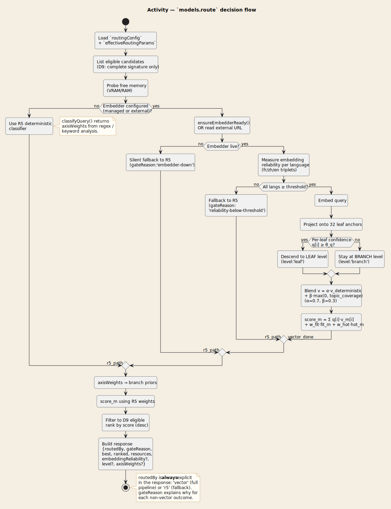

**Request runtime** — UI / MCP call → ranker → ensure target model is
live (spawn if needed) → chat → stream back.

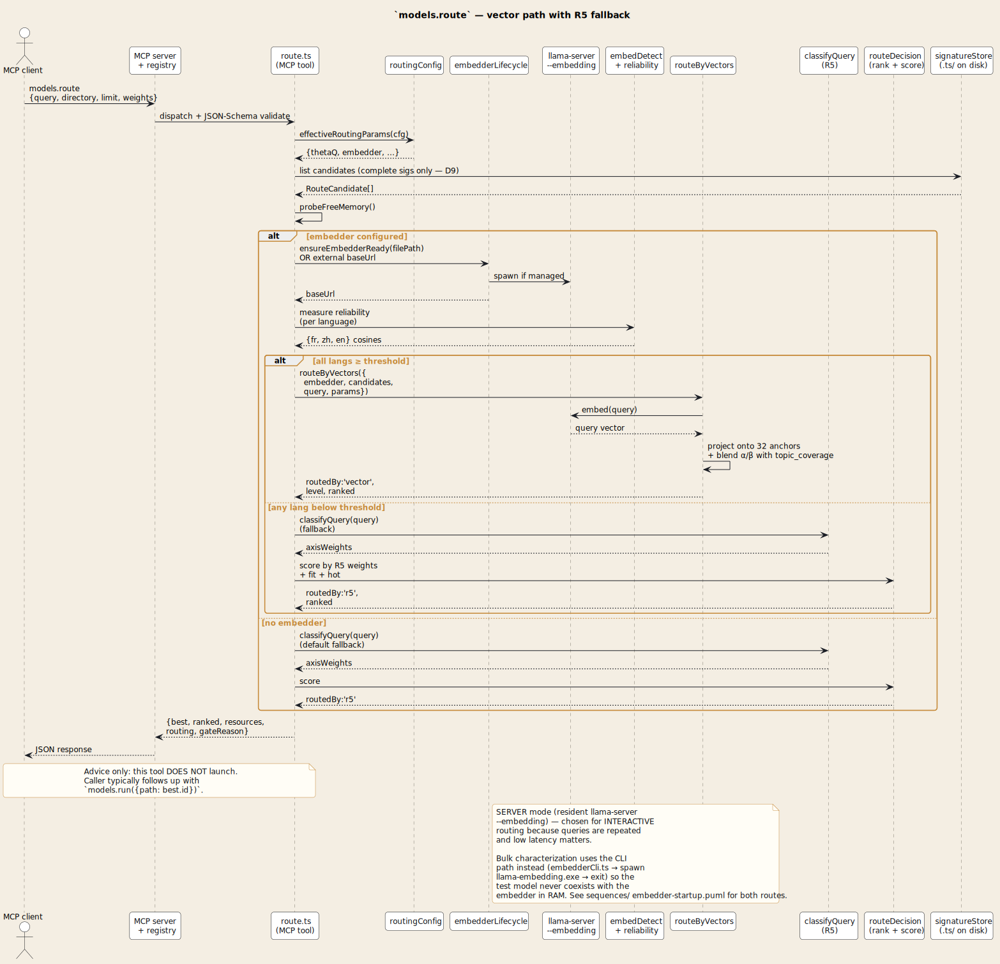

### 8. MCP — exposing the library to external clients

Maestria runs an HTTP+SSE MCP server (`127.0.0.1:41541`, Bearer-token,
opt-in) so Claude Desktop, deer-flow, aider and ad-hoc scripts can
list, search, launch, route and stop models without re-implementing
the metadata layer.

**MCP server stack** — Express + `@modelcontextprotocol/sdk` SSE
transport, **two-tier Bearer auth** (user token by default, optional
admin token), single `registry.ts` tool registration point (tools
self-register on side-effect import from `index.ts`), rotating call
log (`logger.ts` → `~/.tagspaces/mcp.log`), token persistence in
`token.ts` (user lazy-created, admin opt-in/regenerate/revoke).
~40 tools across 11 families covering **full UI parity** with the
renderer:
**`models.*`** (search / get / list_running / run [+admin elevation] /
stop / get_run_params / list_runner_flags),
**`models.route`** (R5 + embedder-gated vector projection),
**`characterize.*`** (start / status / all_start [fire-and-forget] /
all_status / all_cancel / load_signature / get_questions_dir),
**logs** (`models.get_server_log` / `get_error_log` /
`list_server_log_archives` / `runners.get_log`),
**`meta.*`** (patch / enrich + admin `enrich.folder_start` /
`clear_folder`),
**discovery** (`models.sum_shard_bytes` / `list_hosting_folders`),
**`runners.*`** (list / dismiss / open_chat / build_command /
fit_probe + admin save / remove / detect / reprobe),
**`hardware.*`** + **`routing.*`** (detect / detect_raw / get/set
override + get/set routing config, setters admin-gated),
**`tags.*`** + **`description.*`** (sidecar I/O).
Tools opt into `requiresAdmin: true` per definition; the user token
runs every other tool. The `admin: true` branch of `models.run`
triggers OS-level elevation (Windows UAC via `Start-Process
-Verb RunAs`, POSIX via `pkexec`) — stdio capture is lost in that
mode, an exit poller checks every 10 s.

**Long-running tools are fire-and-forget.** `characterize.all_start`
returns immediately with `{ started: true, directory }` instead of
awaiting the multi-hour sweep — callers (Claude Desktop, deer-flow,
sub-agents) cannot usefully block a session for that long, and
routing through a Claude Code sub-agent hits the inverse problem
(restricted permission scope cannot surface the per-tool approval
prompt). Progress is exposed through a sibling `characterize.all_status`
tool returning `{ running, progress, error }`; the terminal snapshot
is retained after the sweep ends so a late poller still sees the
final stats. Single-flight is enforced synchronously upfront so
`all_start` still rejects cleanly when a sweep is already in flight.
The same shape applies to any future tool whose backing operation
can exceed roughly a minute.

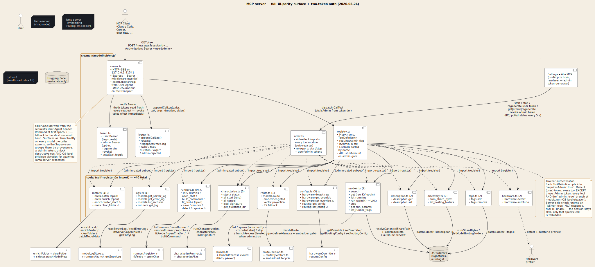

**One tool invocation end-to-end** (e.g. `models.run`) — client opens
SSE → POST /messages with Bearer → server derives `callerLabel` from
the `User-Agent` header (e.g. `"via MCP — Claude/0.4"`, fallback to a
6-char session hash) → registry dispatches → handler →
`launchModelByPath(..., {launchedBy: ctx.callerLabel, paramsOverride:
merge(autotune, sidecar, args.params)})` → response over SSE +
`appendCallLog(caller, tool, duration, ok|err)`. The Superviseur
renderer (polling every 5 s) groups the resulting `ActiveEntry` by
`launchedBy`.

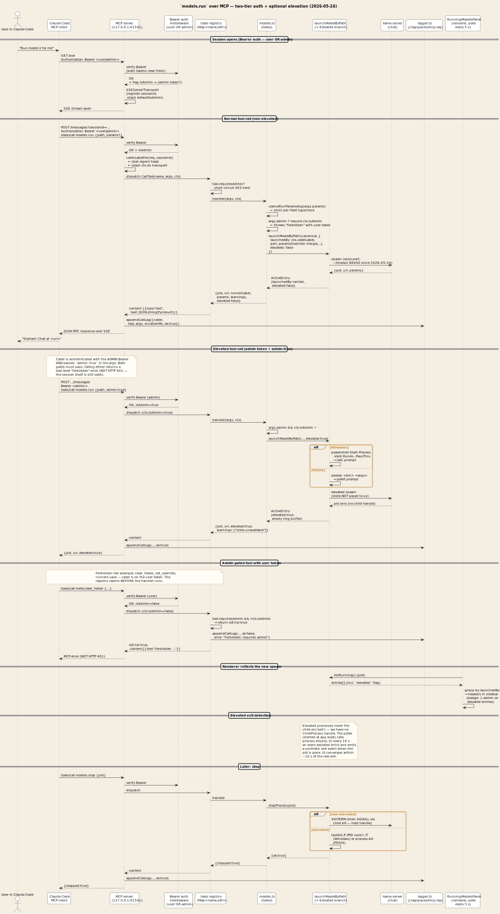

**Headless / tray-only mode** — when Maestria is used purely as an MCP
backend (no human reading the Inférence tab), the renderer Chromium
process is dead weight. Launch with `--headless` / `-H` or set
`MAESTRIA_HEADLESS=1` (or `npm run dev:headless`) and the app boots
with **only** the Electron main process + WS server + MCP server +
tray icon — saving ~250 MB of RAM. The tray entry "Show TagSpaces"
lazily creates a renderer window on demand; closing it returns to the
tray-only state and releases the renderer RAM. The MCP server
auto-starts unconditionally in headless mode (the persisted
`autoStart` setting is ignored since there is no UI to toggle it).
`window-all-closed` is intercepted on every OS in this mode so the
app does not quit when the on-demand window is dismissed — the tray
is the persistent surface, "Quit" lives there.

**Minimise-to-tray (windowed mode)** — when the app is running with
the GUI, clicking the OS minimise button hides the window entirely
(disappears from the taskbar) and leaves only the tray icon. Clicking
the tray entry restores the window instantly. The renderer process
itself stays in RAM (Windows working-set trimmer pages parts of it
out under idle pressure) because tearing the window down with
`destroy()` triggers a native Electron crash (0xC0000005 — chromium
core cannot run with zero `BrowserWindow`s); `hide()` is the
crash-safe path. Distinct from headless mode: headless boots without
ever creating a window; minimise-to-tray demotes an existing one.

### 9. UI surfaces — Salt mockups

When prose doesn't carry the layout, the `mockups/` folder uses
PlantUML's Salt language to sketch the renderer panels. These are not
screenshots — they live in git and diff cleanly.

**Inférence tab** — per-model panel: Run / Configure header,
run-parameters table, Compétence section (R5 radar + collapsible tree
+ freegen projection), Re-caractériser / Questions sources actions.

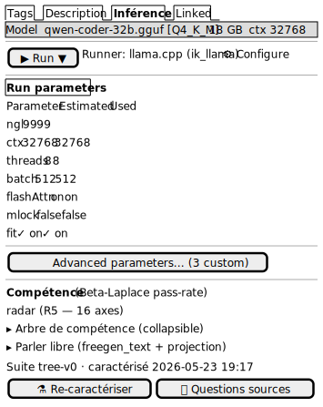

**Bulk panel** — Caractériser tous les modèles: Forcer / Parler libre
/ Sans calcul vectoriel toggles, progress, 3-tab logs viewer (Erreurs
/ Logs serveur / Interactions) with live `prompt_done` streaming since
2026-05-24.

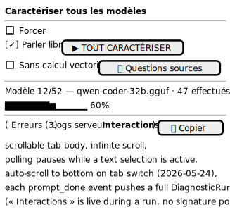

**Superviseur** — the `RunningModelsPanel`: always-open list grouped
by `launchedBy` (Direct / via MCP — … / embedder), bounded scroll,
copy / log / stop actions per row.


All three Salt blocks live in the single file
`mockups/inference-tab.puml` (PlantUML emits one SVG per `@startsalt`
block).

**Welcome screen — Maestria-focused HowToStart** — the welcome panel
ships a 9-step Get-Started stepper (`HowToStart.tsx`) walking a fresh
user through the actual Maestria path rather than the upstream
generic-file-organiser pitch: intro framed around .gguf/.safetensors
+ llama-server + optional MCP, location manager pointed at
the user's models folder (`~/Models`, `D:\models`, …), sidecar layout under `.ts/`, GGUF-header
auto-tags, llama.cpp runner configuration (replaces the upstream
"Creating new files" step — irrelevant for pre-existing model
binaries), Maestria-specific Settings (runners / MCP / hardware
autotune), and a closing pointer at the Inférence tab and MCP
exposure. The same panel's footer list is trimmed for the fork: no
TagSpaces support email, no Mastodon / X follow links, and the
"Web Clipper" entry keeps the upstream "TagSpaces" name since the
extension wasn't forked and remains the one users would install.

## Folder layout

PlantUML sources live exclusively in `docs/en/`. Translatable strings
are catalogued in `docs/en/_includes/i18n/strings_{en,fr}.iuml`; the
language is a CLI flag at render time (`-DLANG=en` / `-DLANG=fr`).
`docs/fr/` only carries the translated `README.md` and the rendered
`svg/` output — there are no parallel PlantUML sources to drift.

```
docs/en/
├── README.md                         ← this file
├── svg/                              ← rendered output (gitignored)
├── _includes/                        ← DRY partials — definitions live ONLY here
│   ├── style.iuml                    ← palette + skinparams + i18n loader
│   ├── i18n/                         ← language catalogues
│   │   ├── strings_en.iuml           ← English STR_* values
│   │   └── strings_fr.iuml           ← French STR_* values (parallel to en)
│   ├── actors.iuml                   ← generic shared actors (component-shape)
│   ├── legend.iuml                   ← rung/prior/none + scoring_scheme
│   ├── classes/                      ← class / type definitions
│   │   ├── routing-types.iuml        ← Signature / BehavioralSignature / …
│   │   ├── competence-tree.iuml      ← CompetenceBranch + COMPETENCE_TREE
│   │   ├── sandbox-types.iuml        ← SandboxProvider ABC + Result/Options/Unavailable
│   │   ├── sandbox-unsafe.iuml       ← UnsafeSandbox
│   │   ├── sandbox-posix.iuml        ← PosixSandbox + Spawner
│   │   ├── sandbox-windows.iuml      ← WindowsSandbox + win-job.ps1 ref
│   │   └── sandbox-index.iuml        ← GetSandbox factory
│   ├── components/                   ← component-level reusable stacks
│   │   ├── mcp-stack.iuml
│   │   ├── routing-stack.iuml
│   │   ├── characterization-stack.iuml
│   │   ├── sandbox-stack.iuml
│   │   ├── embedder-stack.iuml
│   │   └── ui-stack.iuml
│   ├── sequences/
│   │   └── participants.iuml         ← every recurring sequence participant
│   ├── usecase/
│   │   └── actors.iuml               ← use-case-style actors
│   └── states/                       ← (reserved for future shared states)
│
├── system-overview.puml              ← bird's-eye composite
├── deployment.puml                   ← runtime processes + ports
│
├── components/                       ← UML component diagrams
│   ├── mcp-server.puml
│   ├── routing.puml
│   ├── characterization.puml
│   ├── sandbox.puml
│   ├── embedder.puml
│   └── freegen.puml
│
├── sequences/                        ← UML sequence diagrams
│   ├── characterization-flow.puml
│   ├── routing-flow.puml
│   ├── sandbox-execution.puml
│   ├── embedder-startup.puml
│   └── mcp-call.puml
│
├── classes/                          ← UML class diagrams (thin composers)
│   ├── signature.puml
│   ├── competence-tree.puml
│   └── sandbox-providers.puml
│
├── usecase/                          ← UML use case diagrams
│   └── users.puml
│
├── states/                           ← UML state machine diagrams
│   ├── signature-lifecycle.puml
│   ├── embedder-process.puml
│   ├── sandbox-dispatch.puml
│   └── runner-process.puml
│
├── activities/                       ← UML activity diagrams
│   ├── routing-decision.puml
│   ├── characterization-escalation.puml
│   └── sandbox-kill-paths.puml
│
├── objects/                          ← UML object diagrams (instances)
│   ├── characterized-model.puml
│   └── running-models-panel.puml
│
├── packages/                         ← UML package diagram
│   └── modelhub.puml
│
├── c4/                               ← (bonus) C4 model
│   └── context.puml
│
└── mockups/                          ← (bonus) Salt UI mockups
    └── inference-tab.puml            ← 3 @startsalt blocks → 3 SVGs
```

## UML coverage

| UML diagram type | Folder | Files | Rendered output |
|---|---|---|---|
| Class | `classes/` | 3 | [`svg/signature.svg`](svg/signature.svg), [`svg/competence-tree.svg`](svg/competence-tree.svg), [`svg/sandbox-providers.svg`](svg/sandbox-providers.svg) |
| Component | `components/` + `system-overview.puml` | 7 | 6 in `svg/<name>.svg` + [`svg/system-overview.svg`](svg/system-overview.svg) |
| Sequence | `sequences/` | 5 | [`characterization-flow`](svg/characterization-flow.svg), [`routing-flow`](svg/routing-flow.svg), [`sandbox-execution`](svg/sandbox-execution.svg), [`embedder-startup`](svg/embedder-startup.svg), [`mcp-call`](svg/mcp-call.svg) |
| State machine | `states/` | 4 | `svg/states-<name>.svg` (signature, embedder, sandbox dispatch, runner) |
| Activity | `activities/` | 3 | `svg/activity-<name>.svg` (routing decision, char escalation, sandbox kill paths) |
| Use case | `usecase/` | 1 | [`svg/usecase-users.svg`](svg/usecase-users.svg) |
| Object | `objects/` | 2 | [`svg/objects-characterized-model.svg`](svg/objects-characterized-model.svg), [`svg/objects-running-models.svg`](svg/objects-running-models.svg) |
| Package | `packages/` | 1 | [`svg/packages-modelhub.svg`](svg/packages-modelhub.svg) |
| Deployment | root | 1 | [`svg/deployment.svg`](svg/deployment.svg) |
| **Bonus — C4 Context** | `c4/` | 1 | [`svg/c4-context.svg`](svg/c4-context.svg) |
| **Bonus — Salt mockup** | `mockups/` | 1 file, 3 blocks | [`mockup-inference-tab`](svg/mockup-inference-tab.svg), [`mockup-bulk-panel`](svg/mockup-bulk-panel.svg), [`mockup-superviseur`](svg/mockup-superviseur.svg) |

UML diagram types intentionally **not** covered (low value for this codebase):

- Communication diagram — redundant with sequence
- Timing diagram — no hard timing constraints we model
- Interaction overview — too meta for v0
- Profile diagram — we use `<<stereotype>>` ad-hoc, no dedicated profile
- Composite structure — covered well enough by `components/mcp-server.puml`

## Rendering

Sources live only in `docs/en/`. Language is a render-time choice:
pass `-DLANG=en` or `-DLANG=fr` and the same source file produces the
matching SVG. Translatable strings are catalogued under
`_includes/i18n/strings_{en,fr}.iuml`; structural keywords, identifiers
and code snippets stay in the source.

All commands assume `plantuml.jar` lives at the repo root (already
gitignored). Java 8+ is enough; OpenJDK 21 from Android Studio's
bundled JBR works fine on Windows.

1. **VS Code extension** (recommended for one-off edits) — install
   `jebbs.plantuml`, then `Alt+D` on a `.puml`. The extension picks
   up `_includes/*.iuml` automatically. The live preview defaults to
   English; to preview in French, add `"plantuml.commandArgs":
   ["-DLANG=fr"]` to workspace settings (see
   [`.vscode/settings.json.example`](../../.vscode/settings.json.example)).
2. **CLI — batch the whole tree into `docs/en/svg/` and `docs/fr/svg/`**:

   PowerShell (Windows):
   ```powershell
   $java = "C:\Program Files\Android\Android Studio\jbr\bin\java.exe"
   $src = (Get-ChildItem docs\en -Filter *.puml -Recurse).FullName
   & $java -jar plantuml.jar -DLANG=en -tsvg -charset UTF-8 -o "$PWD\docs\en\svg" $src
   & $java -jar plantuml.jar -DLANG=fr -tsvg -charset UTF-8 -o "$PWD\docs\fr\svg" $src
   ```

   bash (macOS / Linux / Git Bash):
   ```bash
   curl -fsSL -o plantuml.jar \
     https://github.com/plantuml/plantuml/releases/latest/download/plantuml.jar
   src=$(find docs/en -name '*.puml')
   java -jar plantuml.jar -DLANG=en -tsvg -charset UTF-8 -o "$(pwd)/docs/en/svg" $src
   java -jar plantuml.jar -DLANG=fr -tsvg -charset UTF-8 -o "$(pwd)/docs/fr/svg" $src
   ```

   The single-output-dir form is intentional — `-o "../svg"` (the old
   convention) scattered output across `docs/svg/` and
   `docs/en/svg/` depending on the source file's depth.
3. **PlantUML web** — paste a SINGLE `.puml` body into
   <https://www.plantuml.com/plantuml/uml/>. ⚠️ Files using `!include`
   relative paths only render locally (the web service can't reach
   our `_includes/`).

Both `docs/en/svg/` and `docs/fr/svg/` should be gitignored (the SVGs
are derived and would just create merge noise — re-render on demand).

## Conventions

- Every `.puml` starts with `!include _includes/style.iuml`. That
  include transitively loads the i18n catalogue, so any `STR_FOO`
  token used downstream resolves automatically.
- **Each class / type / shape / actor / component is defined ONCE**,
  in a partial under `_includes/`. Composers `!include` the partial —
  never redeclare. Editing a field is a one-line change that
  propagates to every composer that references it.
- **Each translatable string is defined ONCE per language**, in
  `_includes/i18n/strings_{en,fr}.iuml`. Source files reference them
  via `STR_FILEBASE_DESCRIPTOR` tokens. To add a new translatable
  label: append parallel entries to both catalogues, then use the
  token in the source.
- Composers are thin — includes + relationships + notes. The notes
  are the only thing they carry that doesn't live in a partial.
- Aliases in partials are stable (e.g. `as PKG_SBX_TYPES`,
  `as CMP_T_MODELS`). If you rename one, every composer breaks
  visibly at the next render — that's intentional.
- Comments (`'…`) live only in the English source. They are stripped
  by the preprocessor and never reach the rendered SVG, so there is
  nothing to translate.
- Scope = AI subsystem only. No TagSpaces-inherited file organiser
  plumbing, no perspective rendering, no general settings —
  documented in `CLAUDE.md` and the inline JSDoc instead.

## Source of truth

Diagrams describe the **current state on `develop`** at the commit
they live in. When you change a wired-up flow (a new tool, a new
sandbox provider, a new routing knob), update the affected partial
under `_includes/` in the same commit — that automatically updates
every composer that references it.

Prose counterpart: [`../../MODELS_HUB.md`](../../MODELS_HUB.md)
(private, gitignored — maintainer's working notes).
