# Maestria — diagrammes d'architecture (PlantUML)

🌐 **Langue** : 🇫🇷 français · [🇬🇧 english](../en/README.md)

Espace conceptuel UML complet de la stack IA / routing / sandbox / MCP /
embedder / caractérisation de Maestria. Les sources PlantUML vivent
dans git pour se differ comme du code. Strictement DRY : chaque
classe / acteur / composant est **défini une seule fois** dans un
partial sous `_includes/`, et référencé depuis chaque composeur via
`!include`.

Les diagrammes sont intégrés inline ci-dessous. Les sources sont à
côté dans `_includes/` + les dossiers par type (`components/`,
`sequences/`, …) ; les SVG rendus atterrissent dans [`svg/`](svg/) —
voir [Rendu](#rendu) pour régénérer après édition.

Le repo contient deux arbres **miroirs par langue** —
[`docs/en/`](../en/) (canonique) et [`docs/fr/`](.) (celui-ci) — avec
le même layout de fichiers. Chaque `.puml` / `.iuml` existe dans les
deux copies ; choisis celle qui correspond à ta langue de lecture.
L'anglais est la source canonique — le français en est traduit.

## Parcours architectural

Les diagrammes ci-dessous sont ordonnés comme tu expliquerais Maestria
à un nouveau contributeur — de l'extérieur vers l'intérieur, en
épluchant une couche à la fois. Lecture top-down en première passe ;
saute directement à une section quand tu cherches un point précis.

### 1. Vue d'ensemble — ce qu'est Maestria

Maestria part d'un fork TagSpaces spécialisé pour parcourir,
caractériser et lancer des modèles `.gguf` locaux depuis `D:\models`.
Trois diagrammes répondent à « c'est quoi » à trois altitudes.

**Contexte C4** — Maestria comme boîte noire entourée des *vrais*
systèmes externes : l'utilisateur, le système de fichiers local,
llama.cpp (`llama-server` et `llama-embedding`), les métadonnées
Hugging Face, et les clients MCP (Claude Desktop, deer-flow, scripts).
À lire en premier.

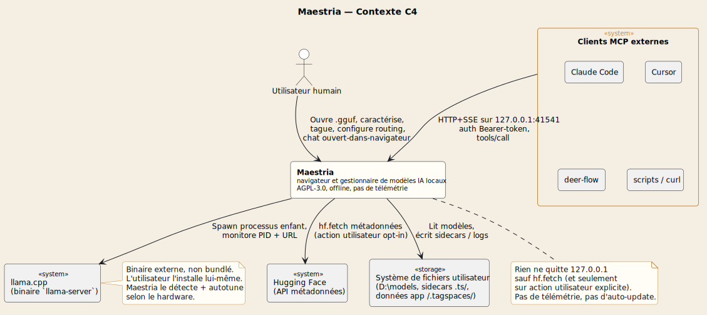

**Vue d'ensemble système** — composite vue d'oiseau qui ouvre la
boîte : chaque composant interne rendu au même niveau via les
partials `_includes/components/*` partagés. Utile pour montrer « où
vit X » sans changer de page.

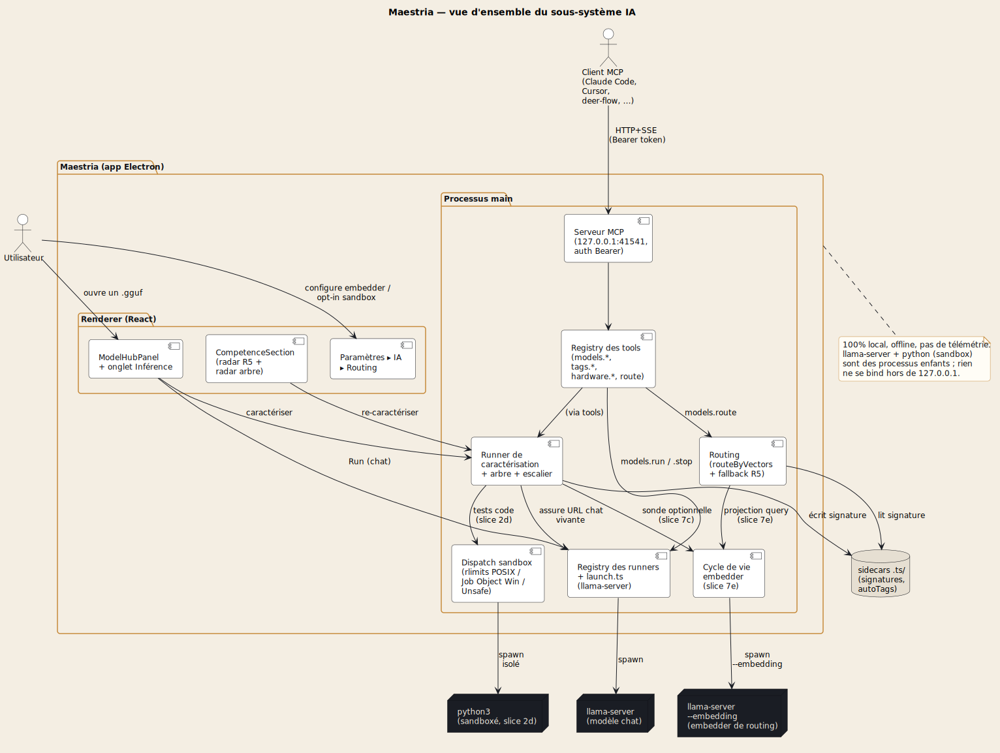

**Déploiement** — topologie runtime : les processus Electron
(renderer + main), les instances `llama-server` spawnées sur
`127.0.0.1:8080/8081/8082`, le listener HTTP+SSE MCP sur
`127.0.0.1:41541`, et la disposition sur disque (`D:\models`,
sidecars sous `.ts/`). Le renderer est **optionnel en mode headless**
(`--headless` / `MAESTRIA_HEADLESS=1`) : l'icône du tray reste la
seule surface UI et spawn une fenêtre à la demande — voir section 8.

Options par emplacement débloquées par le fork vs upstream : la
toggle `fullTextIndex` dans l'éditeur d'emplacement n'est plus
gatée derrière un paywall Pro — le pipeline sous-jacent
(`@tagspaces/tagspaces-search` pour les requêtes et le mode
`extractTextContent` de l'indexeur pour le fichier `tsft.jsonl`
sur disque) est entièrement open-source. Le `BetaLabel` reste pour
signaler que les extracteurs PDF/Office sont encore en cours de
polissage. Pour un dossier `.gguf`/`.safetensors` pur, la payload
fulltext est vide (les fichiers binaires ne fournissent aucun texte
extractible) ; utile quand des fichiers README / model-card / notes
cohabitent avec les binaires de modèles.

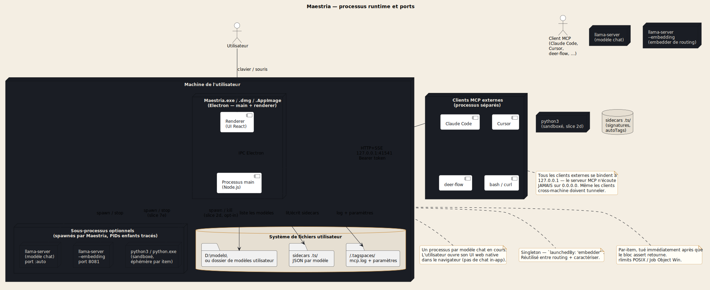

### 2. Qui déclenche quoi — acteurs et cas d'usage

L'utilisateur (UI Maestria) plus l'acteur *MCP-client* (Claude Desktop
/ deer-flow / aider). Les deux peuvent lister / chercher / lancer /
arrêter des modèles ; seul l'utilisateur déclenche la caractérisation
et configure l'opt-in sandbox.

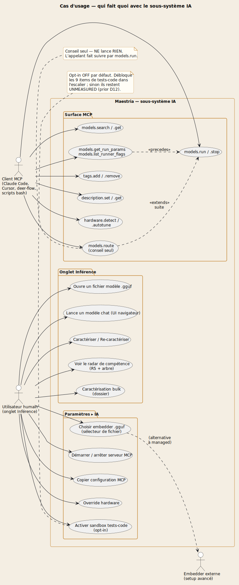

### 3. La bibliothèque de modèles — graphe de packages TS

Les packages TypeScript `src/main/modelhub/**` et
`src/renderer/modelhub/**` avec leurs arêtes de dépendance. Montre
comment `routing/`, `runners/`, `mcp/`, `embedder/`, les I/O sidecar
et l'UI renderer pendent tous de la même racine `modelhub`. Annoté
avec la vague du 2026-05-24 (archives de logs par session,
`--timeout 86400`, filtre 3 niveaux non-chat).

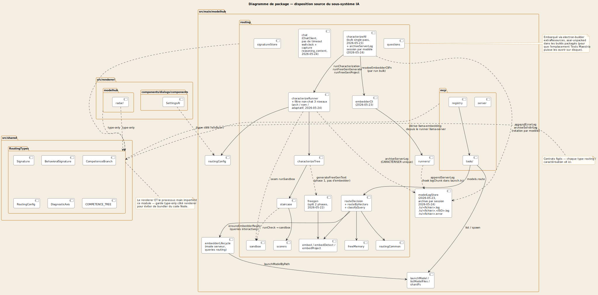

### 4. Lancer et superviser un modèle

Un « modèle » dans Maestria est un processus `llama-server` (ou
`llama-embedding`) long-vivant. Le cycle de vie a la même forme que
l'appelant soit l'UI, le bootstrap embedder, ou un client MCP.

**Machine à états du runner** — Requested → Validating → Spawning →
Booting → Live → Stopping → Exited, plus les branches de rejet
précoce. Inclut l'invariant `--timeout 86400` ajouté le 2026-05-24
pour que le timeout wall-clock de la PR #22907 n'annule jamais un
long chat. `launchedBy` (`null` / `"via MCP — …"` / `"embedder"`)
est le seul champ qui distingue les trois chemins d'appelant.

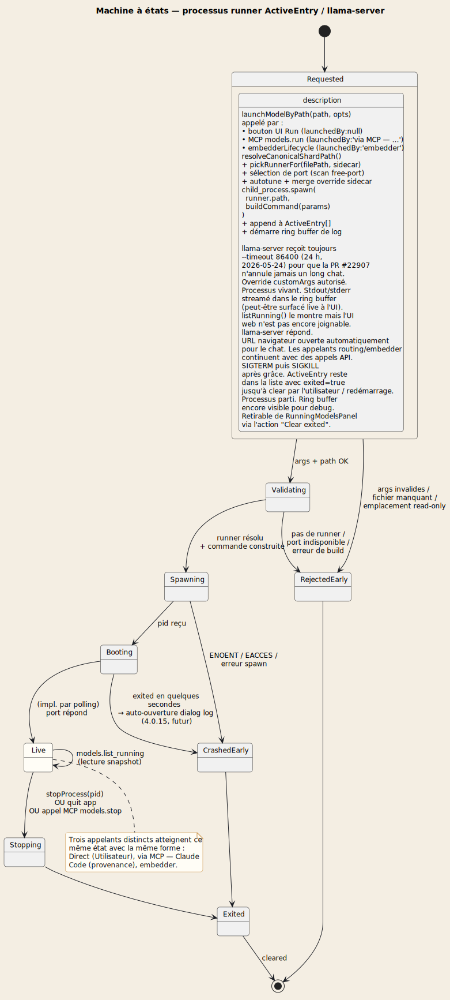

**Snapshot Superviseur** — vue figée de `listRunning()` exactement
comme le renderer la peint dans `RunningModelsPanel` : trois
instances `ActiveEntry` groupées par `launchedBy` ("Direct",
"embedder", "via MCP — Claude Code"). Depuis le 2026-05-24 le
panneau est non-escamotable avec scroll borné.

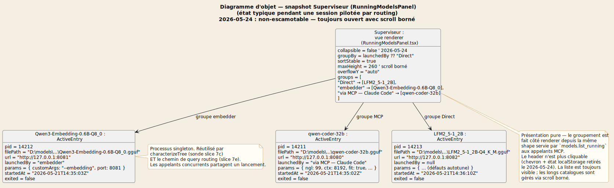

**Démarrage embedder** — cycle de vie singleton du `llama-embedding`
(ou `llama-server` persistant en mode embedding) : qui déclenche le
boot, sélection de port, sonde readiness, réutilisation par
appelants concurrents (sonde slice 7c de characterizeTree + slice 7e
du routing partagent un lancement).

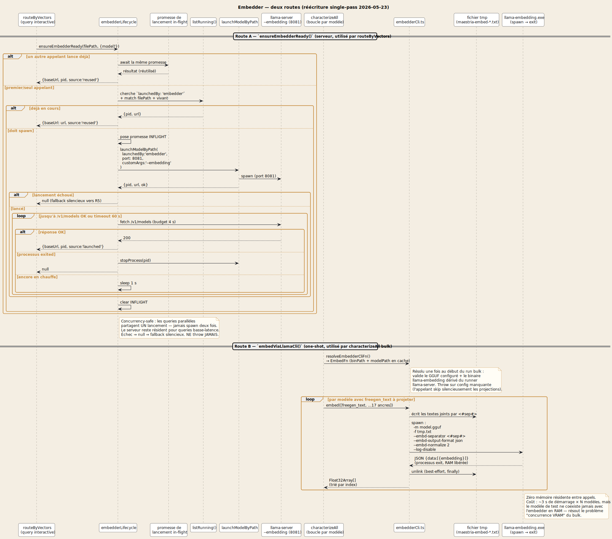

**Composant embedder** — stack interne : gestionnaire de cycle de
vie, client HTTP d'embedding, cache d'ancres, wrapper CLI one-shot.
Le chemin one-shot `llama-embedding.exe --embd-output-format json`
est désormais le défaut pour la projection free-gen (aucun processus
résident pendant la caractérisation).

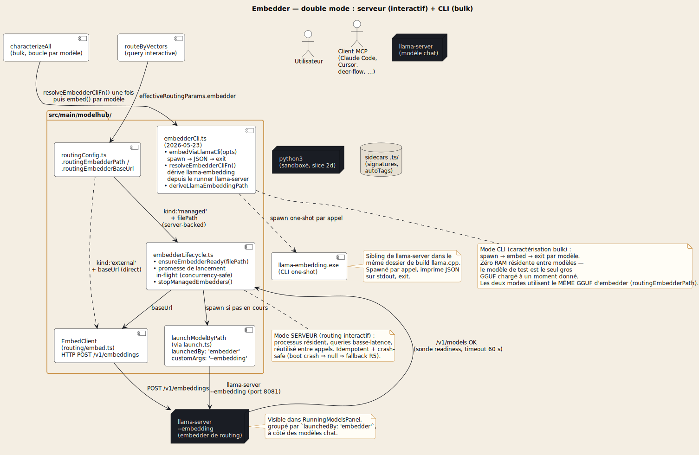

**Dialogue Runner setup** (`RunnerSetupDialog`) — gère les binaires
`llama-server` que Maestria peut spawn. Auto-détecte les entrées sur
PATH et dans les dossiers de build habituels
(`~/llama.cpp/build/bin`, `~/ik_llama.cpp/build/bin`, …) ; ajout
manuel via un sélecteur de fichier natif (icône dossier dans le
champ binary-path → IPC `selectLlamaServerBinaryDialog` → Electron
`dialog.showOpenDialog` filtré sur `.exe` sous Windows, tous
fichiers sous POSIX). Le bouton « llama.cpp releases » passe par
l'IPC `openUrl` → `shell.openExternal` pour que le lien s'ouvre
dans le navigateur par défaut de l'OS (un simple `window.open`
spawn une fenêtre Electron enfant vide dans les builds packagés).

### 5. Caractériser un modèle — le cœur de Maestria

La caractérisation produit une `Signature` (vecteur comportemental
R5 + arbre de scores de compétence + projection free-gen optionnelle)
et la stocke à côté du sidecar du modèle. Le flux est délibérément
adaptatif : tests cheap d'abord, tests coûteux uniquement sur les
modèles qui devraient en bénéficier.

**Politique d'escalade** — filtre non-chat pré-lancement (arch + nom
+ pooling), puis passe R5 avec quarantaine adaptative Tier 3, puis
escalier par branche (slice 4c), puis free-gen + projection
optionnels (différé en phase 2 par `characterizeAll`). À lire en
premier pour comprendre *pourquoi* un modèle donné est ou n'est pas
escaladé.

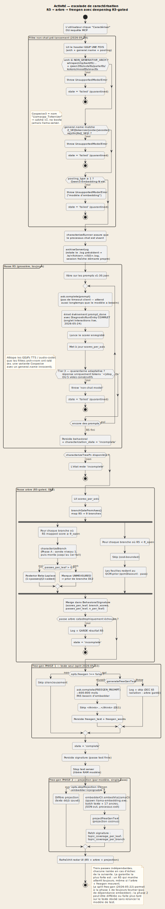

**Runtime complet d'un seul modèle** — UI → `characterizeRunner` →
lecture header → lancement → R5 → arbre → texte free-gen → arrêt
chat-server → embedder one-shot → patch projection → status:'done'.
L'événement `prompt_done` porte désormais le `DiagnosticRunEntry`
complet donc l'onglet « Interactions » se met à jour en direct.

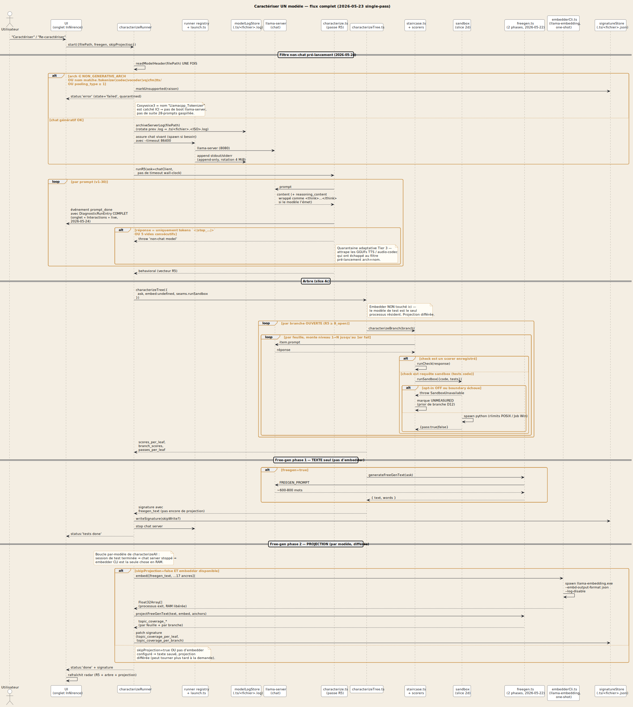

**Forme de la Signature** — `Signature`, `BehavioralSignature`,
`TreeBranchScore`, `freegen_text`,
`topic_coverage_per_leaf/per_branch`, l'enum
`characterization_state`, champ unsupported-reason.

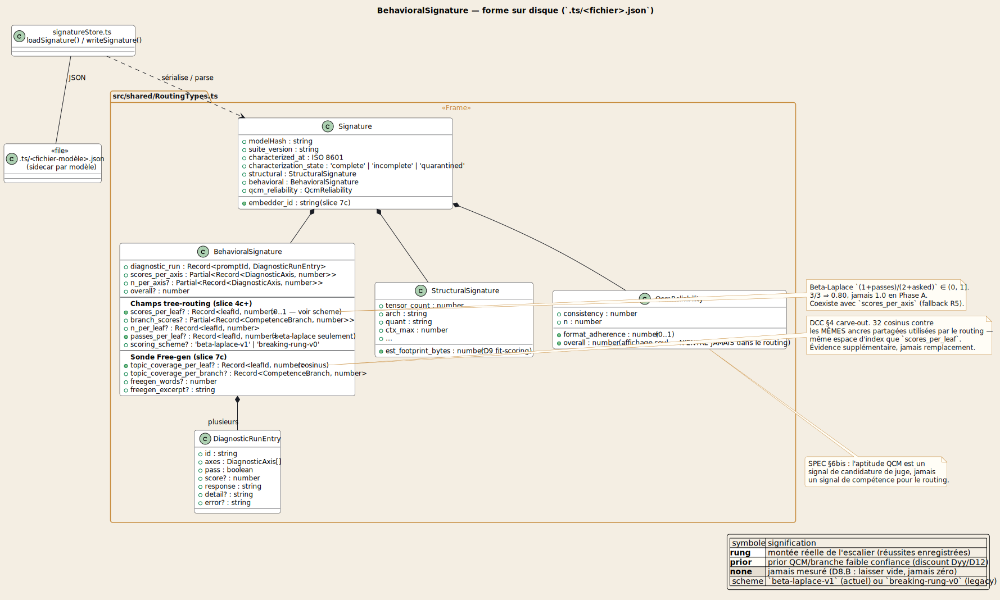

**Exemple concret** — une signature peuplée (qwen-coder-32b après
une Caractériser réussie), valeurs sur chaque champ — plus simple
que le diagramme de classe pour s'orienter la première fois.

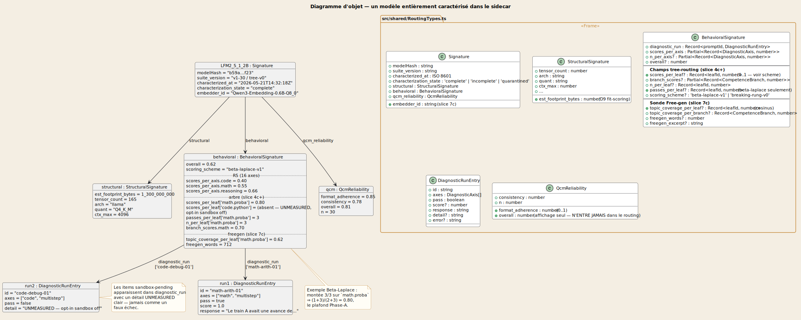

**Cycle de vie de la Signature** — la machine `characterization_state`
du sidecar : `none` → `running` → `done` / `failed` (avec
sous-type quarantined unsupported pour le cas non-chat), `done` →
re-`running` sur Re-caractériser, archive du `.log` précédent à
chaque relancement.

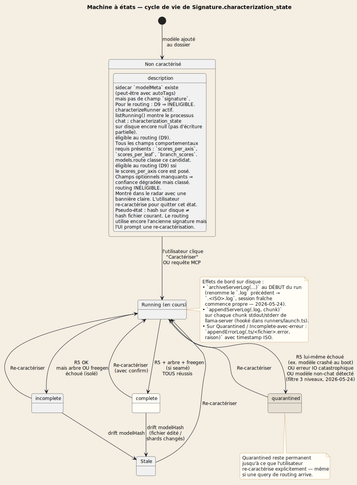

**COMPETENCE_TREE** — l'arbre canonique que l'escalier parcourt :
branches (`reasoning`, `code`, `math`, `factual`, …), feuilles avec
prompts d'items + scorers + checks sandbox optionnels. Défini une
seule fois dans `_includes/classes/competence-tree.iuml`.

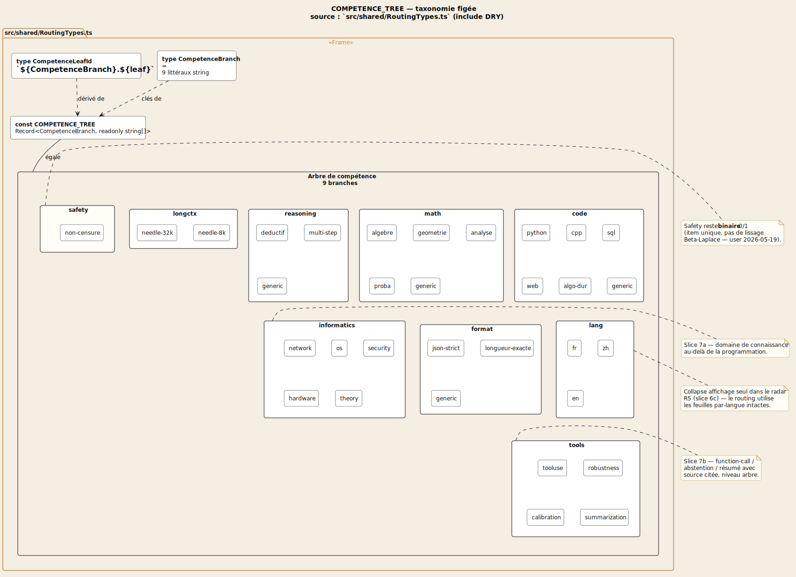

**Module Free-gen** — 2 phases (depuis 2026-05-22) : phase 1 génère
le texte de ~600-800 mots contre le chat server, phase 2 (différée
par modèle dans `characterizeAll`) le projette via l'embedder contre
les 17 textes d'ancrage pour dériver `topic_coverage_*`.

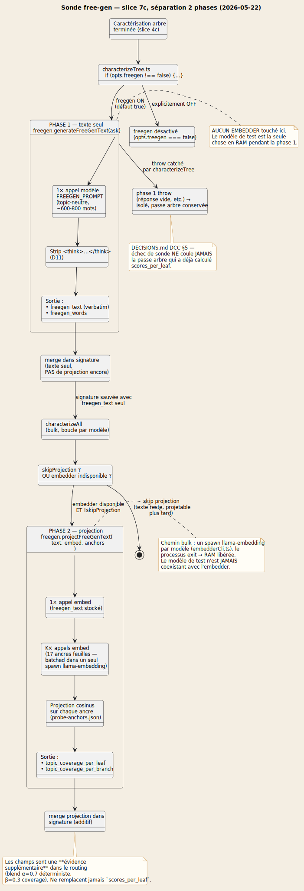

**Stack de caractérisation** — runner, modules R5 + arbre, scorers,
seam sandbox, free-gen, signature store.

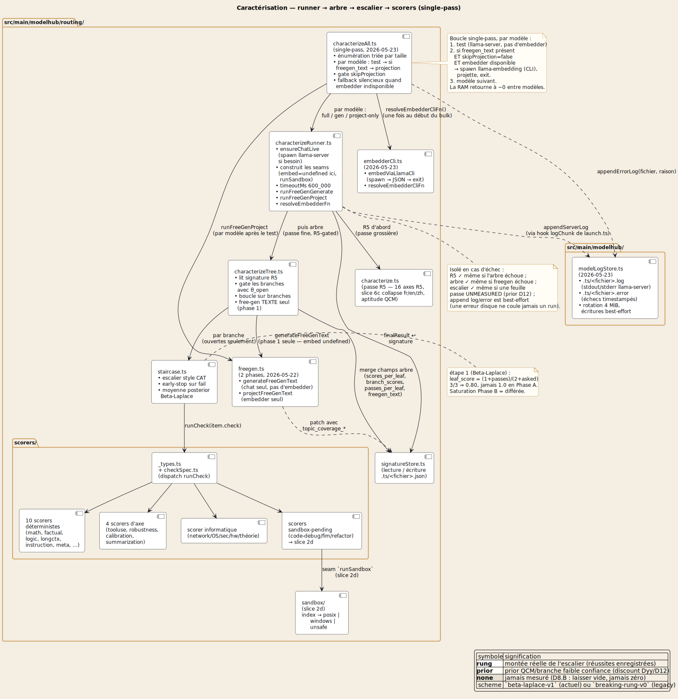

### 6. La sandbox — checks d'exécution de code

Certaines feuilles de compétence exécutent du *code* (cas de tests
Python). Maestria délègue à un provider sandbox choisi par
plateforme, avec un gate opt-in (Paramètres ▸ IA ▸ Routing) — si
l'opt-in est désactivé ou que le test de boundary échoue, les
feuilles qui ont besoin de code sont marquées **UNMEASURED** et le
prior de branche (D12) est utilisé à la place.

**Stack sandbox** — factory de provider, implémentation POSIX
(basée rlimits), implémentation Windows (Job Object via PowerShell),
UnsafeSandbox (fallback dev-only).

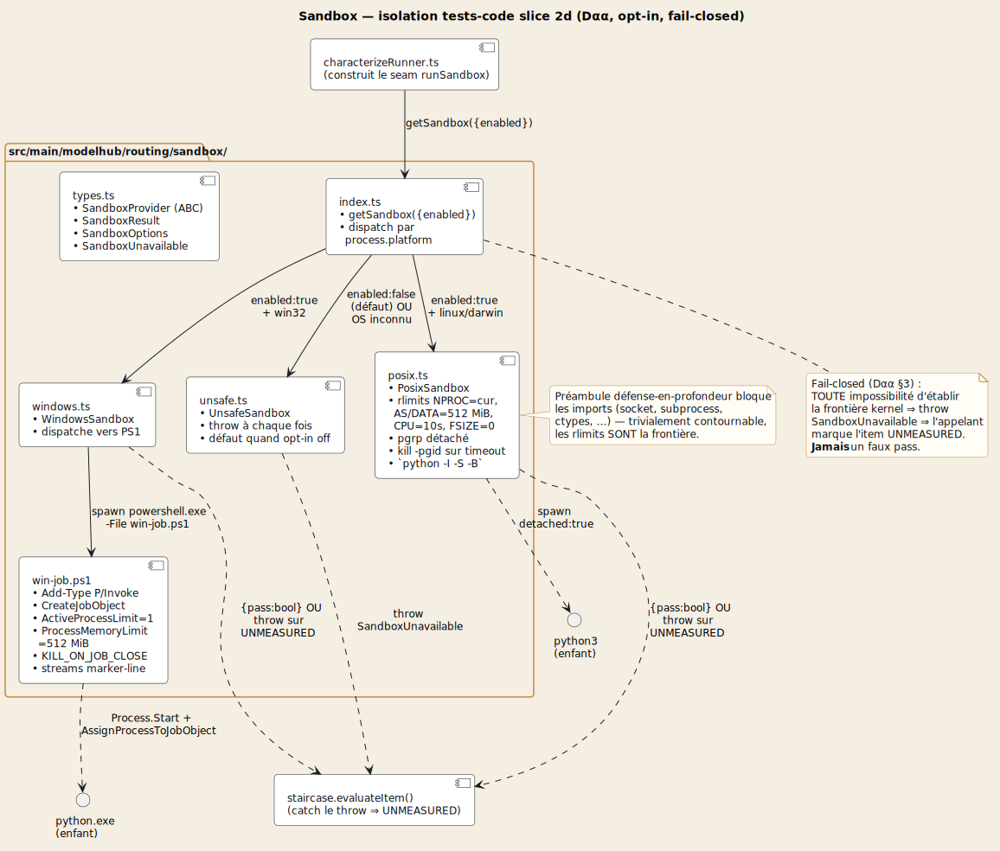

**Hiérarchie de classes Provider** — ABC `SandboxProvider`,
`Result` / `Options` / `Unavailable`, sous-classes concrètes
Posix / Windows / Unsafe.

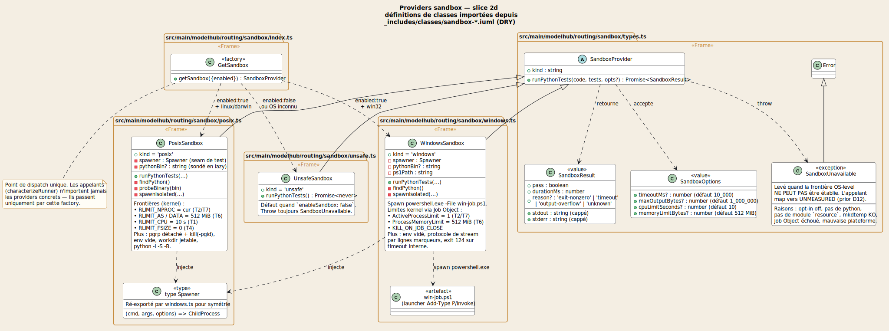

**État de dispatch** — comment le provider pour le run courant est
résolu (plateforme, opt-in, sonde de boundary), quels sont les
fallbacks, et quel état surface `SandboxUnavailable`.

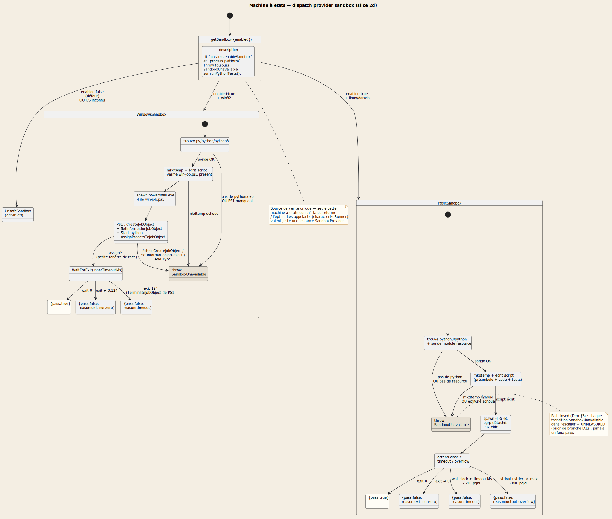

**Un appel `runSandbox({code, tests})` de bout en bout** —
répertoire temp, spawn sous rlimits/Job, capture, jugement, cleanup.

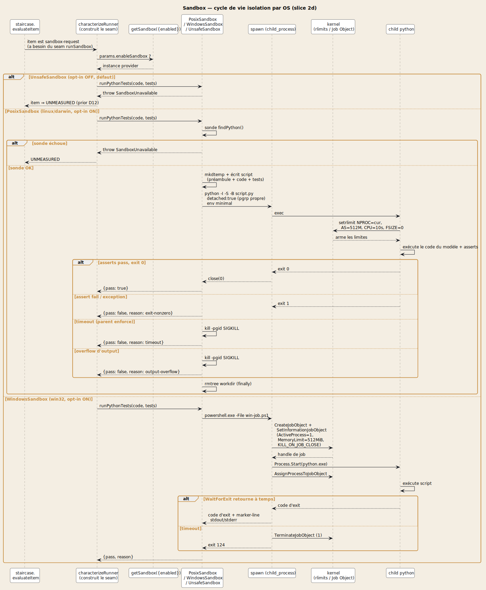

**Chemins de kill** — toutes les façons dont un processus sandboxé
peut mourir (limite CPU, limite RSS, wall clock, exit du parent,
stop utilisateur, watchdog), et ce que chacun remonte à l'appelant.

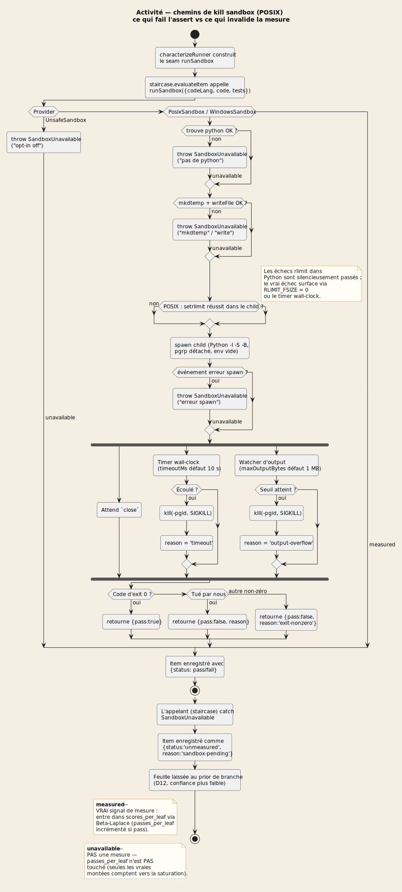

### 7. Routing — utiliser la bibliothèque caractérisée

Une fois que les modèles portent des signatures, la couche routing
peut choisir le meilleur fit pour une requête chat entrante —
scoré contre le prompt utilisateur avec contributions de R5, des
priors de compétence, de la couverture thématique free-gen et de
l'autotune hardware-aware.

**Stack routing** — wrapper client chat (`chat.ts`, pas de timeout
wall-clock depuis 2026-05-24), scorers pilotés par caractériseur,
routing de compétence (slice 9), lookup de projection free-gen,
pont autotune.

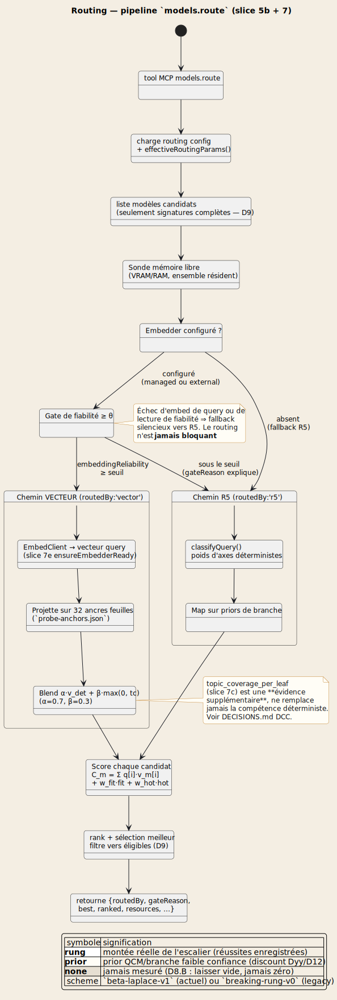

**Politique de décision** — set de candidats, composition du score
(R5 + arbre + couverture thématique), tie-breakers, épingle manuelle
de l'utilisateur, fallback quand pas de signature disponible.

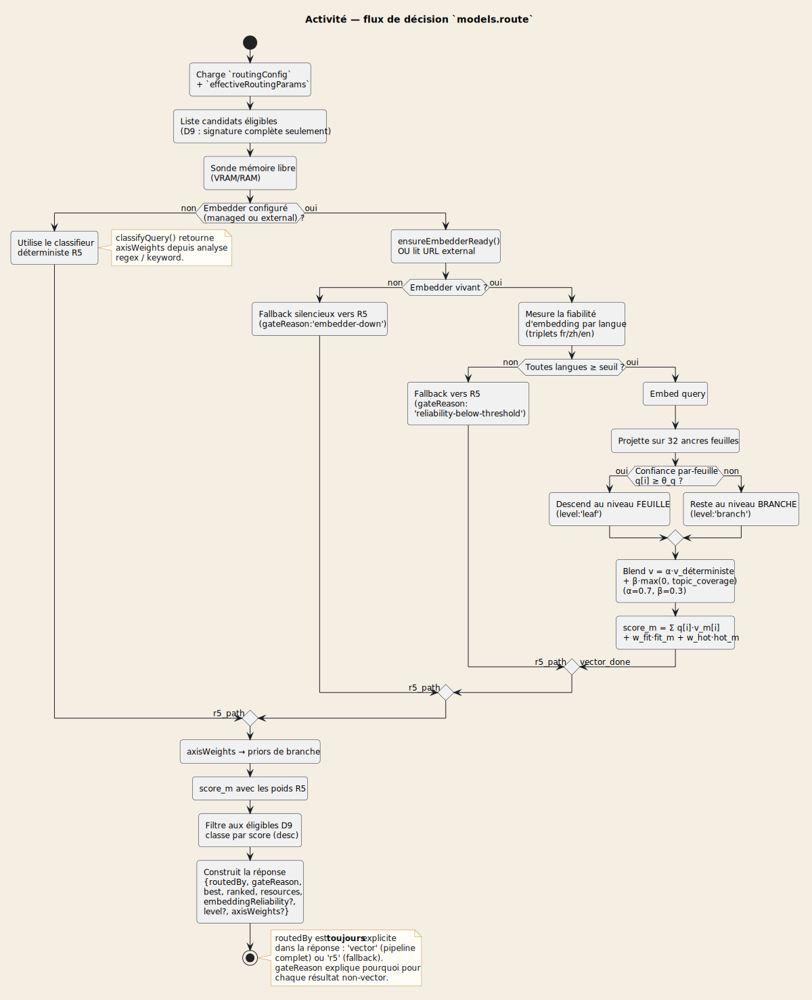

**Runtime d'une requête** — appel UI / MCP → ranker → s'assurer que
le modèle cible est vivant (spawn si nécessaire) → chat → stream
retour.

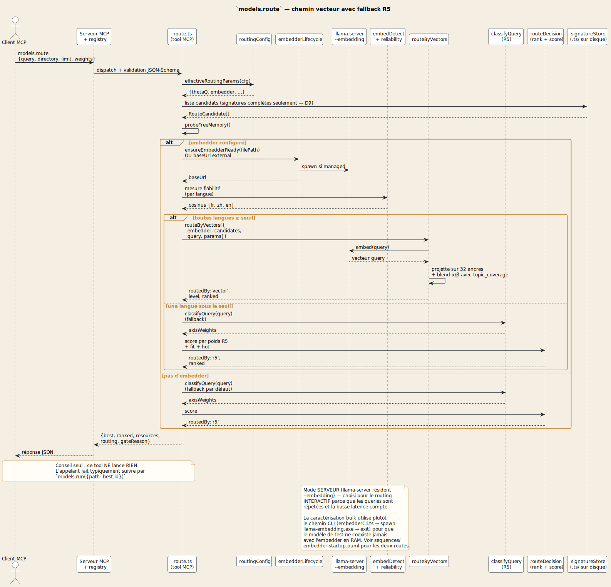

### 8. MCP — exposer la bibliothèque à des clients externes

Maestria fait tourner un serveur MCP HTTP+SSE (`127.0.0.1:41541`,
Bearer token, opt-in) pour que Claude Desktop, deer-flow, aider et
des scripts ad-hoc puissent lister, chercher, lancer, router et
arrêter des modèles sans ré-implémenter la couche métadonnées.

**Stack serveur MCP** — Express + transport SSE
`@modelcontextprotocol/sdk`, **auth Bearer à deux niveaux** (token
user par défaut, token admin optionnel), point unique
d'enregistrement des tools dans `registry.ts` (les tools
s'auto-enregistrent à l'import side-effect depuis `index.ts`), log
d'appels rotatif (`logger.ts` → `~/.tagspaces/mcp.log`), persistance
des tokens dans `token.ts` (user lazy-créé, admin
opt-in/regénérer/révoquer). ~40 tools sur 11 familles couvrant la
**parité UI complète** avec le renderer :
**`models.*`** (search / get / list_running / run [+élévation admin]
/ stop / get_run_params / list_runner_flags),
**`models.route`** (R5 + projection vectorielle embedder-gated),
**`characterize.*`** (start / status / all_start [fire-and-forget] /
all_status / all_cancel / load_signature / get_questions_dir),
**logs** (`models.get_server_log` / `get_error_log` /
`list_server_log_archives` / `runners.get_log`),
**`meta.*`** (patch / enrich + admin `enrich.folder_start` /
`clear_folder`),
**discovery** (`models.sum_shard_bytes` / `list_hosting_folders`),
**`runners.*`** (list / dismiss / open_chat / build_command /
fit_probe + admin save / remove / detect / reprobe),
**`hardware.*`** + **`routing.*`** (detect / detect_raw / get/set
override + get/set routing config, setters admin-gated),
**`tags.*`** + **`description.*`** (I/O sidecar).
Les tools opt-in `requiresAdmin: true` par définition ; le token
user fait tourner tous les autres. La branche `admin: true` de
`models.run` déclenche une élévation OS (UAC Windows via
`Start-Process -Verb RunAs`, POSIX via `pkexec`) — la capture
stdio est perdue dans ce mode, un poller d'exit check toutes les
10 s.

**Les tools long-running sont fire-and-forget.** `characterize.all_start`
rend la main immédiatement avec `{ started: true, directory }` au
lieu d'attendre le sweep multi-heures — les appelants (Claude
Desktop, deer-flow, sous-agents) ne peuvent pas utilement bloquer
une session aussi longtemps, et router via un sous-agent Claude Code
heurte le problème inverse (le scope de permissions restreint ne
peut pas surfacer le prompt d'approbation par tool). La progression
est exposée par un tool frère `characterize.all_status` qui renvoie
`{ running, progress, error }` ; le snapshot terminal est retenu
après la fin du sweep pour qu'un poller tardif voie les stats
finales. Le single-flight est appliqué synchroniquement upfront pour
que `all_start` rejette proprement quand un sweep est déjà en cours.
Le même pattern s'applique à tout futur tool dont l'opération peut
dépasser environ une minute.

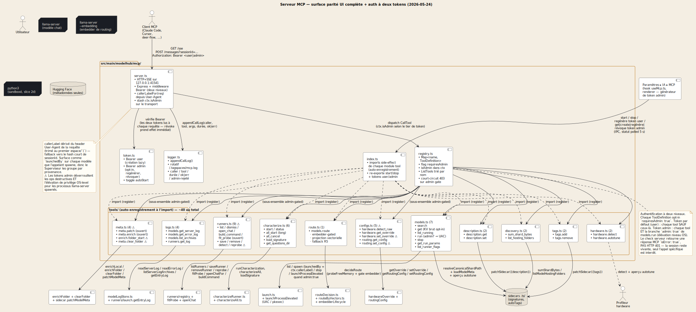

**Une invocation de tool de bout en bout** (ex. `models.run`) — le
client ouvre SSE → POST /messages avec Bearer → le serveur dérive
`callerLabel` depuis le header `User-Agent` (ex. `"via MCP —
Claude/0.4"`, fallback vers un hash 6-char de la session) → le
registry dispatche → handler → `launchModelByPath(...,
{launchedBy: ctx.callerLabel, paramsOverride: merge(autotune,
sidecar, args.params)})` → réponse sur SSE +
`appendCallLog(caller, tool, durée, ok|err)`. Le renderer
Superviseur (poll toutes les 5 s) groupe l'`ActiveEntry` résultant
par `launchedBy`.

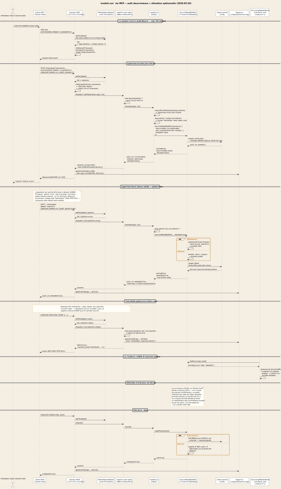

**Mode headless / tray-only** — quand Maestria est utilisée purement
comme backend MCP (personne ne lit l'onglet Inférence), le process
Chromium renderer est du poids mort. Lance avec `--headless` / `-H`
ou pose `MAESTRIA_HEADLESS=1` (ou `npm run dev:headless`) et l'app
boote avec **uniquement** le process Electron main + serveur WS +
serveur MCP + icône tray — ~250 Mo de RAM économisés. L'entrée tray
« Afficher TagSpaces » crée la fenêtre renderer à la demande ; la
fermer ramène à l'état tray-only et libère la RAM du renderer. Le
serveur MCP démarre automatiquement et inconditionnellement en mode
headless (le réglage `autoStart` persisté est ignoré puisqu'il n'y
a pas d'UI pour le basculer). `window-all-closed` est intercepté
sur tous les OS dans ce mode pour que l'app ne quitte pas quand la
fenêtre à la demande est fermée — le tray est la surface persistante,
« Quitter » y vit.

**Minimise-to-tray (mode fenêtré)** — quand l'app tourne avec la GUI,
cliquer sur le bouton minimiser de l'OS cache complètement la fenêtre
(elle disparaît de la barre des tâches) et ne laisse que l'icône tray.
Cliquer sur l'entrée tray restaure la fenêtre instantanément. Le
process renderer reste en RAM (le working-set trimmer de Windows
pagine une partie sous pression idle) parce que détruire la fenêtre
avec `destroy()` déclenche un crash natif d'Electron (0xC0000005 —
le cœur chromium ne tolère pas zéro `BrowserWindow`) ; `hide()` est
le chemin crash-safe. Distinct du mode headless : headless boote sans
jamais créer de fenêtre, minimise-to-tray dégrade une existante.

### 9. Surfaces UI — maquettes Salt

Quand la prose ne porte pas le layout, le dossier `mockups/` utilise
le langage Salt de PlantUML pour esquisser les panneaux du renderer.
Ce ne sont pas des screenshots — ils vivent dans git et diffent
proprement.

**Onglet Inférence** — panneau par modèle : header Run / Configure,
table des paramètres de lancement, section Compétence (radar R5 +
arbre escamotable + projection freegen), actions Re-caractériser /
Questions sources.

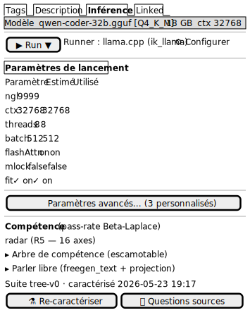

**Panneau bulk** — Caractériser tous les modèles : toggles Forcer /
Parler libre / Sans calcul vectoriel, progression, viewer de logs
3 onglets (Erreurs / Logs serveur / Interactions) avec streaming
live `prompt_done` depuis 2026-05-24.

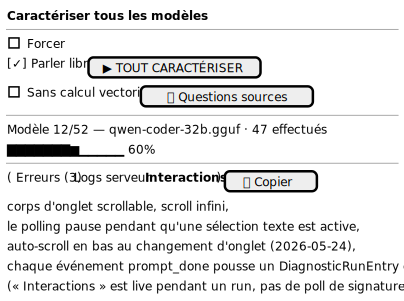

**Superviseur** — le `RunningModelsPanel` : liste toujours-ouverte
groupée par `launchedBy` (Direct / via MCP — … / embedder), scroll
borné, actions copier / log / stop par ligne.


Les trois blocs Salt vivent dans le fichier unique
`mockups/inference-tab.puml` (PlantUML émet un SVG par bloc
`@startsalt`).

**Écran d'accueil — HowToStart focalisé Maestria** — le panneau
d'accueil embarque un stepper Get-Started en 9 étapes
(`HowToStart.tsx`) qui guide un nouvel utilisateur sur le vrai
parcours Maestria au lieu du pitch générique upstream de gestion
de fichiers : intro recadrée sur .gguf/.safetensors + llama-server +
MCP optionnel, gestionnaire d'emplacements pointé sur `D:\models`
/ `~/models`, layout sidecar sous `.ts/`, auto-tags depuis les
headers GGUF, configuration des runners llama.cpp (remplace
l'étape upstream « Création de nouveaux fichiers » — non pertinente
pour des binaires de modèles pré-existants), Paramètres
spécifiques Maestria (runners / MCP / autotune matériel) et un
pointeur final vers l'onglet Inférence et l'exposition MCP. La
liste footer du même panneau est élaguée pour le fork : pas d'email
de support TagSpaces, pas de liens Mastodon / X, et l'entrée
« Web Clipper » garde le nom upstream « TagSpaces » puisque
l'extension n'a pas été forkée et reste celle que les utilisateurs
installeraient.

## Disposition du dossier

```
docs/fr/
├── README.md                         ← ce fichier
├── svg/                              ← sortie rendue (gitignored)
├── _includes/                        ← partials DRY — définitions UNIQUEMENT ici
│   ├── style.iuml                    ← palette + skinparams
│   ├── actors.iuml                   ← acteurs partagés génériques (forme component)
│   ├── legend.iuml                   ← rung/prior/none + scoring_scheme
│   ├── classes/                      ← définitions de classes / types
│   │   ├── routing-types.iuml        ← Signature / BehavioralSignature / …
│   │   ├── competence-tree.iuml      ← CompetenceBranch + COMPETENCE_TREE
│   │   ├── sandbox-types.iuml        ← SandboxProvider ABC + Result/Options/Unavailable
│   │   ├── sandbox-unsafe.iuml       ← UnsafeSandbox
│   │   ├── sandbox-posix.iuml        ← PosixSandbox + Spawner
│   │   ├── sandbox-windows.iuml      ← WindowsSandbox + ref win-job.ps1
│   │   └── sandbox-index.iuml        ← Factory GetSandbox
│   ├── components/                   ← stacks réutilisables niveau composant
│   │   ├── mcp-stack.iuml
│   │   ├── routing-stack.iuml
│   │   ├── characterization-stack.iuml
│   │   ├── sandbox-stack.iuml
│   │   ├── embedder-stack.iuml
│   │   └── ui-stack.iuml
│   ├── sequences/
│   │   └── participants.iuml         ← chaque participant récurrent de séquence
│   ├── usecase/
│   │   └── actors.iuml               ← acteurs style use-case
│   └── states/                       ← (réservé pour de futurs états partagés)
│
├── system-overview.puml              ← composite vue d'oiseau
├── deployment.puml                   ← processus runtime + ports
│
├── components/                       ← diagrammes UML de composants
│   ├── mcp-server.puml
│   ├── routing.puml
│   ├── characterization.puml
│   ├── sandbox.puml
│   ├── embedder.puml
│   └── freegen.puml
│
├── sequences/                        ← diagrammes UML de séquences
│   ├── characterization-flow.puml
│   ├── routing-flow.puml
│   ├── sandbox-execution.puml
│   ├── embedder-startup.puml
│   └── mcp-call.puml
│
├── classes/                          ← diagrammes UML de classes (composeurs fins)
│   ├── signature.puml
│   ├── competence-tree.puml
│   └── sandbox-providers.puml
│
├── usecase/                          ← diagrammes UML de cas d'usage
│   └── users.puml
│
├── states/                           ← diagrammes UML d'état
│   ├── signature-lifecycle.puml
│   ├── embedder-process.puml
│   ├── sandbox-dispatch.puml
│   └── runner-process.puml
│
├── activities/                       ← diagrammes UML d'activité
│   ├── routing-decision.puml
│   ├── characterization-escalation.puml
│   └── sandbox-kill-paths.puml
│
├── objects/                          ← diagrammes UML d'objets (instances)
│   ├── characterized-model.puml
│   └── running-models-panel.puml
│
├── packages/                         ← diagramme UML de packages
│   └── modelhub.puml
│
├── c4/                               ← (bonus) modèle C4
│   └── context.puml
│
└── mockups/                          ← (bonus) maquettes UI Salt
    └── inference-tab.puml            ← 3 blocs @startsalt → 3 SVG
```

## Couverture UML

| Type de diagramme UML | Dossier | Fichiers | Sortie rendue |
|---|---|---|---|
| Classe | `classes/` | 3 | [`svg/signature.svg`](svg/signature.svg), [`svg/competence-tree.svg`](svg/competence-tree.svg), [`svg/sandbox-providers.svg`](svg/sandbox-providers.svg) |
| Composant | `components/` + `system-overview.puml` | 7 | 6 dans `svg/<nom>.svg` + [`svg/system-overview.svg`](svg/system-overview.svg) |
| Séquence | `sequences/` | 5 | [`characterization-flow`](svg/characterization-flow.svg), [`routing-flow`](svg/routing-flow.svg), [`sandbox-execution`](svg/sandbox-execution.svg), [`embedder-startup`](svg/embedder-startup.svg), [`mcp-call`](svg/mcp-call.svg) |
| Machine à états | `states/` | 4 | `svg/states-<nom>.svg` (signature, embedder, sandbox dispatch, runner) |
| Activité | `activities/` | 3 | `svg/activity-<nom>.svg` (décision routing, escalade caract., kill paths sandbox) |
| Cas d'usage | `usecase/` | 1 | [`svg/usecase-users.svg`](svg/usecase-users.svg) |
| Objet | `objects/` | 2 | [`svg/objects-characterized-model.svg`](svg/objects-characterized-model.svg), [`svg/objects-running-models.svg`](svg/objects-running-models.svg) |
| Package | `packages/` | 1 | [`svg/packages-modelhub.svg`](svg/packages-modelhub.svg) |
| Déploiement | racine | 1 | [`svg/deployment.svg`](svg/deployment.svg) |
| **Bonus — Contexte C4** | `c4/` | 1 | [`svg/c4-context.svg`](svg/c4-context.svg) |
| **Bonus — Maquette Salt** | `mockups/` | 1 fichier, 3 blocs | [`mockup-inference-tab`](svg/mockup-inference-tab.svg), [`mockup-bulk-panel`](svg/mockup-bulk-panel.svg), [`mockup-superviseur`](svg/mockup-superviseur.svg) |

Types de diagrammes UML délibérément **non** couverts (peu de valeur
pour cette codebase) :

- Diagramme de communication — redondant avec séquence
- Diagramme de timing — pas de contraintes temporelles dures à modéliser
- Vue d'interaction — trop méta pour v0
- Diagramme de profil — on utilise `<<stereotype>>` ad-hoc, pas de profil dédié
- Structure composite — couverte assez bien par `components/mcp-server.puml`

## Rendu

Toutes les commandes supposent que `plantuml.jar` vit à la racine du
repo (déjà gitignored). Java 8+ suffit ; OpenJDK 21 du JBR bundle
d'Android Studio marche bien sous Windows.

1. **Extension VS Code** (recommandé pour les édits ponctuels) —
   installer `jebbs.plantuml`, puis `Alt+D` sur un `.puml`.
   L'extension prend en compte `_includes/*.iuml` automatiquement.
2. **CLI — batch tout l'arbre vers `docs/fr/svg/`** :

   PowerShell (Windows) :
   ```powershell
   $java = "C:\Program Files\Android\Android Studio\jbr\bin\java.exe"
   $fr = (Get-ChildItem docs\fr -Filter *.puml -Recurse).FullName
   & $java -jar plantuml.jar -tsvg -charset UTF-8 -o "$PWD\docs\fr\svg" $fr
   ```

   bash (macOS / Linux / Git Bash) :
   ```bash
   curl -fsSL -o plantuml.jar \
     https://github.com/plantuml/plantuml/releases/latest/download/plantuml.jar
   java -jar plantuml.jar -tsvg -charset UTF-8 \
     -o "$(pwd)/docs/fr/svg" $(find docs/fr -name '*.puml')
   ```

   La forme dossier-de-sortie-unique est intentionnelle.
3. **PlantUML web** — coller le corps d'UN SEUL `.puml` dans
   <https://www.plantuml.com/plantuml/uml/>. ⚠️ Les fichiers utilisant
   des chemins `!include` relatifs ne rendent qu'en local (le service
   web ne peut pas accéder à nos `_includes/`).

`docs/fr/svg/` devrait être gitignored (les SVG sont dérivés et
créeraient juste du bruit de merge — re-rendre à la demande).

## Conventions

- Chaque `.puml` commence par `!include _includes/style.iuml`.
- **Chaque classe / type / shape / acteur / composant est défini UNE
  FOIS**, dans un partial sous `_includes/`. Les composeurs
  `!include` le partial — jamais redéclarer. Éditer un champ est un
  changement d'une ligne qui se propage à chaque composeur qui le
  référence.
- Les composeurs sont fins — includes + relations + notes. Les
  notes sont la seule chose qu'ils portent qui ne vit pas dans un
  partial.
- Les alias dans les partials sont stables (ex. `as PKG_SBX_TYPES`,
  `as CMP_T_MODELS`). Si tu en renommes un, chaque composeur casse
  visiblement au prochain render — c'est intentionnel.
- Périmètre = sous-système IA uniquement. Pas de plomberie file
  organiser héritée de TagSpaces, pas de rendu de perspectives, pas
  de paramètres généraux — documenté dans `CLAUDE.md` et le JSDoc
  inline à la place.
- **Cohérence avec `docs/en/`** : quand tu touches un `.puml` /
  `.iuml`, modifie le miroir anglais dans le même commit. La source
  canonique est l'anglais ; le français en est traduit.

## Source de vérité

Les diagrammes décrivent l'**état actuel sur `develop`** au commit où
ils vivent. Quand tu changes un flux câblé (un nouveau tool, un
nouveau provider sandbox, un nouveau knob routing), mets à jour le
partial affecté sous `_includes/` dans le même commit — ça met
automatiquement à jour chaque composeur qui le référence.

Contrepartie prose : [`../../MODELS_HUB.md`](../../MODELS_HUB.md)
(privé, gitignored — notes de travail du mainteneur).
